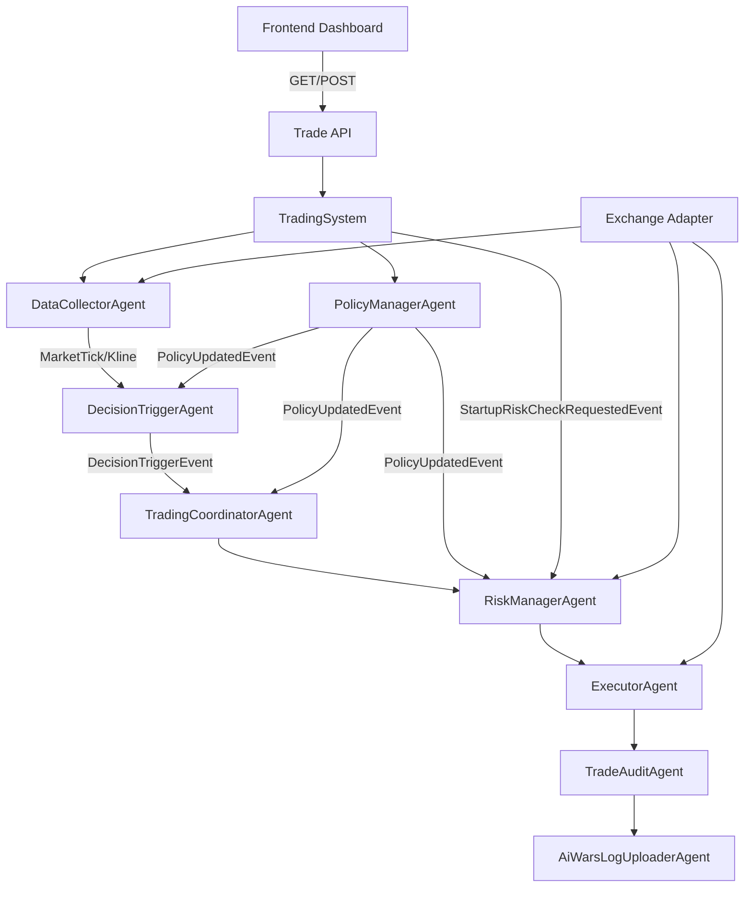

# Design Document

## Overview

本设计针对 `apps/Aevatar.Trading/` 做三件事：  
1) 抽象交易所 API（Weex/OKX 可配置切换，能力不一致可降级）；  
2) 以“价格变化触发”为核心，不再靠固定 interval 触发 AI 决策；系统启动时先做一次 AI 风险检查；  
3) 让 AI 通过工具动态调整触发与风控参数；前端重排布局，突出仓位、风险与 AI 决策。

## Steering Document Alignment

### Technical Standards (tech.md)
- **Protobuf-First**：新增跨边界 State/Event/Config 全部用 `.proto` 定义（触发条件、参数更新、风险检查等）。
- **Runtime Agnostic**：交易所适配层与 Agent 逻辑解耦，保持 Local/Orleans/ProtoActor 一致。
- **Central Package Management**：新增依赖统一在 `Directory.Packages.props` 管理。
- **Port Policy**：不使用 `:5000` 默认端口，保持现有 `7100/5173` 方案。

### Project Structure (structure.md)
- 新的交易所适配层放在 `Aevatar.Trade/Infrastructure/Exchanges/`（按 `Weex/Okx` 子目录组织）。
- 新的触发/参数管理 Agent 放在 `Aevatar.Trade/Agents/Triggers/` 与 `Aevatar.Trade/Agents/Policy/`。
- 前端重布局仍在 `apps/Aevatar.Trading/frontend/`，复用 `components/` 基础组件。

## Code Reuse Analysis

### Existing Components to Leverage
- **`IWeexApiClient` / `Weex*ApiClient`**：保留现有实现，作为 Weex 适配器的底层实现。
- **`DataCollectorAgent`**：继续承担行情拉取与事件发布，调整为“触发输入源”。
- **`TradingCoordinatorAgent` / `RiskManagerAgent` / `ExecutorAgent`**：保留角色分工，修改触发入口与参数来源。
- **`TradeAuditAgent` / `AiWarsLogUploaderAgent`**：继续作为审计与上传链路。
- **`TradingSystem`**：保留系统编排入口，新增触发与参数管理的初始化和启动流程。
- **前端 `Panel` / `StatusPill` / `ExchangeViz`**：复用基础组件，重排信息层级。

### Integration Points
- **DI 注册**：`ServiceCollectionExtensions.AddWeexTradingServices` 重构为通用 `AddTradingExchangeServices`（根据配置选择 Weex/OKX 适配器）。
- **配置快照**：`MetaController` 继续对前端提供安全配置，但新增 Exchange/Trigger/Policy 信息。
- **系统控制**：`TradingController` 保留 initialize/start/stop，增加参数读取与更新接口。
- **AI Tools**：复用 `DotNetFileSkillTool` 机制，为 AI 添加“参数更新工具”。

## Architecture

核心变化：将“固定 interval 触发 AI 决策”替换为“价格变化/风险条件触发”，并新增参数管理与启动风险检查。



## Components and Interfaces

### Component 1: Exchange Abstraction
- **Purpose:** 统一交易所 API，支持 Weex/OKX 配置切换与能力差异降级。
- **Interfaces:**
  - `IExchangeMarketDataClient`: `GetTickerAsync`, `GetKlinesAsync`
  - `IExchangeAccountClient`: `GetBalancesAsync`, `GetPositionsAsync`
  - `IExchangeTradeClient`: `PlaceOrderAsync`, `CancelOrderAsync`, `GetOpenOrdersAsync`
  - `IExchangeCapabilityProvider`: `SupportsPositions`, `SupportsWebSocket`, `SupportsFundingRate` 等
- **Dependencies:** 现有 `IWeexApiClient`；新增 `OkxApiClient`（后续实现）
- **Reuses:** `WeexWebSocketClient`、`WeexApiConfig`（改为 Exchange 选择的具体实现）

### Component 2: DecisionTriggerAgent
- **Purpose:** 根据行情变化/风险条件判断是否触发 AI 决策。
- **Interfaces:** `HandleMarketTick`, `HandlePositionSnapshot`, `HandlePolicyUpdated`
- **Dependencies:** `DecisionTriggerConfig`（Proto）；价格/仓位快照
- **Reuses:** 现有 `MarketTickEvent`、`KlineUpdateEvent`

### Component 3: PolicyManagerAgent
- **Purpose:** 保存动态参数（触发条件、冷却时间、风险阈值），支持 AI Tool 更新。
- **Interfaces:** `UpdatePolicy`, `GetPolicySnapshot`
- **Dependencies:** `TradingPolicyConfig`（Proto）
- **Reuses:** `AIGAgentBase` 的 Tool 注册机制

### Component 4: TradingCoordinatorAgent（改造）
- **Purpose:** 仅在 `DecisionTriggerEvent` 或手工触发时进行 AI 决策。
- **Interfaces:** `HandleDecisionTrigger`, `HandlePolicyUpdated`
- **Dependencies:** `DecisionTriggerEvent`, `TradingPolicyConfig`
- **Reuses:** 现有 LLM / Cognitive Mesh 决策流程

### Component 5: RiskManagerAgent（改造）
- **Purpose:** 增加“启动风险检查”入口与动态参数应用。
- **Interfaces:** `HandleStartupRiskCheck`, `HandlePolicyUpdated`
- **Dependencies:** `StartupRiskCheckRequestedEvent`, `TradingPolicyConfig`
- **Reuses:** 现有风险评估 + 工具调用逻辑

### Component 6: Frontend Layout
- **Purpose:** 将核心信息聚焦在仓位、风险与 AI 决策。
- **Interfaces:** `/api/meta`, `/api/trading/status`, `/api/decision/*`, `/api/policy/*`, `/api/positions`
- **Dependencies:** 新增 API DTO
- **Reuses:** `Panel`, `StatusPill`, `ExchangeViz`

## Data Models

### Model 1
```
// 交易所配置与选择（Proto）
enum ExchangeType {
  EXCHANGE_TYPE_UNSPECIFIED = 0;
  WEEX = 1;
  OKX = 2;
}

message ExchangeConfig {
  ExchangeType exchange_type = 1;
  string mode = 2;                  // "Contract" / "Spot" / "Futures"
  repeated string symbols = 3;
  bool enable_websocket = 4;
}
```

### Model 2
```
// 触发策略（Proto）
message DecisionTriggerConfig {
  double price_change_pct = 1;      // 价格变化触发阈值（百分比）
  double price_change_abs = 2;      // 价格变化触发阈值（绝对值）
  int32 window_seconds = 3;         // 变化统计窗口
  int32 cooldown_seconds = 4;       // 触发冷却时间
  bool trigger_on_startup = 5;      // 启动是否触发 AI 风险检查
}

message DecisionTriggerEvent {
  string trigger_id = 1;
  string symbol = 2;
  string reason = 3;                // "PRICE_CHANGE" / "RISK" / "MANUAL"
  double delta_pct = 4;
  double delta_abs = 5;
  google.protobuf.Timestamp timestamp = 6;
}
```

### Model 3
```
// 动态参数更新（Proto）
message TradingPolicyConfig {
  DecisionTriggerConfig trigger = 1;
  RiskControlConfig risk = 2;
  TradingConfig trading = 3;
}

message TradingPolicyUpdatedEvent {
  string updated_by = 1;            // Agent id / Tool id
  TradingPolicyConfig policy = 2;
  google.protobuf.Timestamp timestamp = 3;
}
```

### Model 4
```
// 启动风险检查（Proto）
message StartupRiskCheckRequestedEvent {
  string request_id = 1;
  google.protobuf.Timestamp timestamp = 2;
}

message StartupRiskCheckResultEvent {
  string request_id = 1;
  bool action_required = 2;
  string action = 3;                // "CLOSE_ALL" / "REDUCE" / "HOLD"
  string reason = 4;
  google.protobuf.Timestamp timestamp = 5;
}
```

## Error Handling

### Error Scenarios
1. **交易所不支持某能力（如 positions）**
   - **Handling:** 通过 `IExchangeCapabilityProvider` 返回 `NotSupported`，触发 UI 提示并跳过该模块。
   - **User Impact:** 前端显示“功能不可用”，系统继续运行。

2. **行情拉取失败 / WebSocket 不可用**
   - **Handling:** 自动降级到 REST polling；失败时指数退避并记录 `MarketDataDegradedEvent`。
   - **User Impact:** UI 显示“行情退化模式”，但系统继续可用。

3. **AI Tool 更新参数不合法**
   - **Handling:** `PolicyManagerAgent` 拒绝并返回结构化错误（原因 + 当前合法范围）。
   - **User Impact:** 前端显示错误，旧参数保持不变。

## Testing Strategy

### Unit Testing
- `DecisionTriggerAgent` 的阈值判断/冷却逻辑
- `PolicyManagerAgent` 的参数校验与更新
- 交易所适配器的能力标识与映射逻辑

### Integration Testing
- Weex 适配器完整链路（行情、仓位、下单）
- OKX 适配器基本联通性（Mock or sandbox）
- AI Tool 更新参数 -> Trigger/Coordinator/RiskManager 生效

### End-to-End Testing
- 启动系统 -> 自动风险检查 -> 产生结果事件
- 行情变化触发 -> AI 决策 -> 风控 -> 执行/审计闭环
- 前端展示仓位/风险/决策更新
