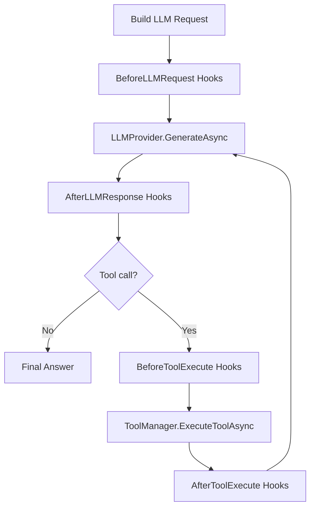

# Design Document

## Overview

本设计将 “oh-my-opencode hooks/harness 思路”移植到 Aevatar：在 `Aevatar.Agents.AI.Core` 中引入一个统一的 Hook 管线，用于治理 **LLM 请求/响应、Tool 执行前后、错误与重试** 等跨切面问题。

关键原则：
- **默认安全**：Hook 不能扩大权限，只能收敛；不得绕过 `AllowInternalTools/AllowDangerousTools`。
- **best-effort**：Hook 失败不阻塞主链路，但必须可观测。
- **最小侵入**：优先在 `AIGAgentBase` 的现有流程点插入 pipeline，不重构业务 Agent。
- **可组合**：多个 hooks 可叠加（排序/禁用），形成可控的 harness。

## Steering Document Alignment

### Technical Standards (tech.md)

本仓库未提供 steering `tech.md`；本设计遵循仓库既有标准：
- 跨边界类型必须 Protobuf（`AGENTS.md`）。
- AI 能力单一入口为 `Aevatar.Agents.AI.Core`（`src/Aevatar.Agents.AI.Core/docs/ARCHITECTURE.md`）。

### Project Structure (structure.md)

无 steering `structure.md`；本设计将新代码集中放入：
- `src/Aevatar.Agents.AI.Core/Hooks/*`（新目录，单文件单职责）
- 小改动点落在 `AIGAgentBase.Tools.cs` / `AIGAgentBase.cs`（插入 hook 调用）

## Code Reuse Analysis

### Existing Components to Leverage

- **`AIGAgentBase.Tools.cs`**：已有 tool loop、allowlist、安全策略（暴露/执行双重 guard）、工具事件发布。
- **`AevatarToolManager`**：已有工具执行安全策略（`ToolExecutionContext.Allow*`），以及 Protobuf-Any 的安全 JSON 格式化。
- **`AgentSkills`**：已有 “按需加载 + allowlist” 的治理手段，可被 hooks 复用（例如加载 skill 后动态收敛工具集合）。
- **兼容性修复样例**：`DeepSeekThinkingModeFixHandler` 展示“协议差异补齐”的 best-effort 模式，可抽象成 “Provider hook”。

### Integration Points

- **LLM 调用链**：`LLMProvider.GenerateAsync(llmRequest, ct)` 前后插 hook。
- **Tool 执行链**：`ExecuteAllowedToolAsync` / `ToolManager.ExecuteToolAsync` 前后插 hook。
- **错误处理**：对 LLM/Tool 抛错、以及 tool loop guard（重复调用/超轮次）插入 hook 供观测与降级。

## Architecture

### Modular Design Principles

- **接口稳定、上下文明确**：Hook 通过 `HookContext` 读写信息，避免把 `AIGAgentBase` 内部细节泄漏给 hooks。
- **同步/异步统一**：所有 hook 为 `Task`，并遵循 best-effort（异常捕获 + 继续）。
- **可排序**：每个 hook 有 `Priority`（越小越先执行）。
- **可禁用**：通过 Options/配置禁用某些 hooks（类似 oh-my-opencode 的 `disabled_hooks`）。

### Hook Pipeline（高层图）



## Components and Interfaces

### Component 1: `IAevatarAgentHook`

- **Purpose:** 定义 Hook 的能力边界与生命周期方法。
- **Interfaces（建议）:**
  - `int Priority { get; }`
  - `string Name { get; }`
  - `Task BeforeLLMRequestAsync(HookContext ctx, CancellationToken ct)`
  - `Task AfterLLMResponseAsync(HookContext ctx, CancellationToken ct)`
  - `Task BeforeToolExecuteAsync(HookContext ctx, CancellationToken ct)`
  - `Task AfterToolExecuteAsync(HookContext ctx, CancellationToken ct)`
  - `Task OnErrorAsync(HookContext ctx, Exception ex, CancellationToken ct)`
- **Dependencies:** 无（纯接口）
- **Reuses:** 无

### Component 2: `AevatarAgentHookPipeline`

- **Purpose:** 管理 hooks 列表（排序/启用/禁用），并在指定阶段执行。
- **Interfaces:**
  - `IReadOnlyList<IAevatarAgentHook> Hooks { get; }`
  - `Task RunBeforeLLMRequestAsync(...)` 等阶段方法
  - 内部统一 `try/catch`，失败 best-effort
- **Dependencies:** `ILogger`、`IOptions<AevatarAgentHookOptions>`（禁用列表）
- **Reuses:** 复用现有日志风格（`ILogger`）

### Component 3: `HookContext`（运行时上下文）

- **Purpose:** 在不暴露内部结构的前提下，把关键信息传给 hooks，并允许 hooks 做“收敛型修改”。
- **建议字段（最小集）:**
  - `string AgentId`
  - `string AgentType`
  - `string RequestId`（对齐 `ChatRequest.RequestId`）
  - `AevatarLLMRequest? LlmRequest`
  - `AevatarLLMResponse? LlmResponse`
  - `string? ToolName`
  - `Dictionary<string, object>? ToolArguments`
  - `ToolExecutionResult? ToolResult`
  - `Dictionary<string, object> Metadata`（标注截断/降级/重试原因）
  - `HookPolicy Policy`（只读：AllowInternalTools/AllowDangerousTools + 允许的输出预算）
- **Dependencies:** 仅 AI.Core 的 abstractions 类型
- **Reuses:** `ToolExecutionContext` 的策略字段（语义一致）

### Component 4: 内置 Hooks（MVP）

1) **`ToolOutputTruncationHook`**
- **Purpose:** 限制 tool result 输出长度，标注 `truncated`，避免把大文本塞回 LLM。
- **Behavior:**
  - 在 `AfterToolExecute` 阶段检查 `ToolResult.Content` 长度；
  - 超限则截断（保留头尾 + 省略标记），并写入 `ctx.Metadata["tool_output_truncated"]=true`。

2) **`ContextBudgetMonitorHook`**
- **Purpose:** 监控消息数/字符数，接近阈值时发出“软信号”，供策略/日志使用。
- **Behavior:**
  - 在 `BeforeLLMRequest` 阶段统计 `LlmRequest.Messages` 数量与总字符；
  - 超过阈值标注 `ctx.Metadata["context_budget_warning"]=...`；
  - MVP 先不做自动 compaction，只提供可观测信号（避免引入复杂度）。

3) **`ProviderCompatibilityHook`（占位）**
- **Purpose:** 把类似 `DeepSeekThinkingModeFixHandler` 的“补字段/兼容修复”收敛为 hook。
- **Behavior:**
  - MVP 可先做 “assistant 消息缺 `reasoning_content` 时补空串” 的逻辑（如果当前 provider 暴露该字段）。
  - 具体实现以不破坏现有 provider 为前提：先放接口与示例，不强行迁移 MEAI 的 handler。

## Data Models

### Options: `AevatarAgentHookOptions`

```text
- disabledHooks: string[]    // 类似 oh-my-opencode disabled_hooks
- maxToolOutputChars: int    // 截断阈值（默认 16000）
- contextMessageWarn: int    // 消息条数阈值
- contextCharsWarn: int      // 字符阈值
```

> 注意：Options 属于跨边界配置对象；若会跨 runtime 传输，则必须 Protobuf。MVP 阶段先作为进程内 DI 配置（不跨边界）。

## Error Handling

### Error Scenarios

1. **Scenario 1: Hook 执行抛异常**
   - **Handling:** 捕获异常，记录日志（包含 hook 名/阶段/RequestId），继续主链路。
   - **User Impact:** 无；最多是失去某些护栏（例如未截断）。

2. **Scenario 2: Hook 试图扩大权限**
   - **Handling:** Pipeline 在执行前注入只读 `Policy`，内置 hook 仅能收敛；若检测到 hook 试图启用危险工具，拒绝并记日志。
   - **User Impact:** 无；保持安全策略。

3. **Scenario 3: 截断导致信息不足**
   - **Handling:** 截断保留头尾并提示；允许未来扩展“引用原始结果的可检索存储”（不在 MVP）。
   - **User Impact:** 模型可能需要再次调用工具或要求更小输出。

## Testing Strategy

### Unit Testing

- Pipeline 排序/禁用逻辑：输入 hooks 列表 + disabledHooks，验证执行顺序与跳过行为。
- best-effort：某 hook 抛异常不影响其他 hook 被调用。
- ToolOutputTruncationHook：超限截断、标注 metadata、内容可预测。

### Integration Testing

- 在 `AIGAgentBase` 的 tool loop 中注入 pipeline（可用测试 subclass/模拟 provider），验证：
  - Before/After hook 被触发；
  - tool result 被截断后写回 llmRequest；
  - 仍能完成一次完整的 “tool -> llm -> answer” 循环。

### End-to-End Testing

MVP 不新增 E2E；后续结合 `docs/coding-agent/TASKS.md` 的工具链再补。


