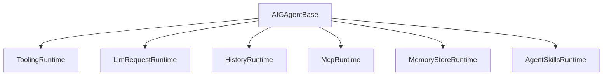

# Design Document

## Overview

Stage 4 以“保持行为不变、缩小基座半径”为设计目标，将 `AIGAgentBase` 中的工具系统与 LLM Request 组装逻辑进一步收敛到内部 runtime 组件，使基座只保留稳定的 orchestration 与 override 点，同时补齐 YAML 策略审计的一致性规范与文档同步。

## Steering Document Alignment

### Technical Standards (tech.md)
- 遵循 **Protobuf‑first** 与 **Runtime Agnostic** 原则：新 runtime 为 internal sealed class，不新增跨边界类型。
- 保持 **best‑effort** 语义：MCP / WebSearch / Memory / Skills 仍不阻断主流程。
- 不引入新依赖，依旧使用 `Microsoft.Extensions.*` 与现有 abstractions。

### Project Structure (structure.md)
- 新增 internal runtime 组件放在 `src/Aevatar.Agents.AI.Core/` 下单一职责目录。
- 保持“每文件单一职责”与“单目录 ≤ 8 文件”约束。
- 文档按 `docs/` 与 `docs/aigagentbase/` 分层组织。

## Code Reuse Analysis

### Existing Components to Leverage
- **McpRuntime / MemoryStoreRuntime / HistoryRuntime**：作为 runtime 抽离范式。
- **AgentSkillsRuntime**：示例化“薄 façade + runtime”模式。
- **LlmCallInstrumentationScope**：保持 LLM 观测逻辑不变。
- **AIGAgentBase.Tools.* / Chat.cs**：作为抽离源。

### Integration Points
- **AIGAgentBase**：保留 `protected virtual` override 点，新增 internal wrapper 仅供 runtime 调用。
- **AIGAgentBase.Tools.Policy.cs**：YAML 策略审计字段标准化，仍由 applier 调用。

## Architecture

本次重构新增两个 internal runtime：

1) **ToolingRuntime**：封装工具系统状态与流程  
2) **LlmRequestRuntime**：封装 LLM 请求组装逻辑  

`AIGAgentBase` 变为“薄 façade”，只负责协调与 override 点。

### Modular Design Principles
- **Single File Responsibility**：Tooling / LLM Request 分离
- **Component Isolation**：runtime 独立持有内部状态与 helper
- **Service Layer Separation**：基座只做 orchestration，runtime 做细节
- **Utility Modularity**：保持 BestEffort、Telemetry 等独立

## Components and Interfaces

### ToolingRuntime
- **Purpose:** 负责工具系统内部状态、注册、缓存、allowlist 校验与执行防线
- **Interfaces:**
  - `InitializeAsync(...)`
  - `RegisterToolsAsync(...)`
  - `RefreshCachesAsync(...)`
  - `BuildToolInstructionBlock(...)`
  - `ExecuteAllowedToolAsync(...)`
- **Dependencies:** `AIGAgentBase`（internal wrappers）、`IAevatarToolManager`
- **Reuses:** `AIGAgentBase.Tools.*` 现有逻辑（迁移到 runtime）

### LlmRequestRuntime
- **Purpose:** 组装 `AevatarLLMRequest`（prompt + tools + history + allowlist）
- **Interfaces:**
  - `BuildRequest(ChatRequest request)`
- **Dependencies:** `AIGAgentBase`（system prompt、history、tool allowlist）
- **Reuses:** `BuildEffectiveSystemPromptWithSummary()` / `BuildToolInstructionBlock()` 现有逻辑

### YAML Policy Audit (existing)
- **Purpose:** 固定日志字段与审计结构，确保跨版本可追溯
- **Interfaces:** `LogYamlToolPolicyDecision(...)`（保持入口不变）
- **Reuses:** `AIGAgentBase.Tools.Policy.cs` 现有 hook

## Data Models

### Runtime‑only Classes

无新增持久化或跨边界模型。新增类型均为 `internal sealed` runtime helper，不引入 Protobuf 变更。

## Error Handling

### Error Scenarios
1. **Tooling 初始化失败**
   - **Handling:** best‑effort + Debug/Warning 日志，不阻断 Chat/Stream
   - **User Impact:** 工具不可用但聊天仍可继续
2. **LLM Request 组装异常**
   - **Handling:** 保持现有异常行为（fail‑fast），并沿用现有日志/telemetry
   - **User Impact:** 与现有行为一致

## Testing Strategy

### Unit Testing
- 不新增独立测试框架；复用现有 AIGAgentBase.Tests
- 重点验证：allowlist 逻辑、tool loop guard、policy deny 行为一致

### Integration Testing
- `dotnet test test/Aevatar.Agents.AI.Core.Tests/ -c Release`
- 重点验证：ChatAsync / ChatStreamAsync 行为不变

### End-to-End Testing
- 不新增 E2E；保持现有示例/应用验证路径

