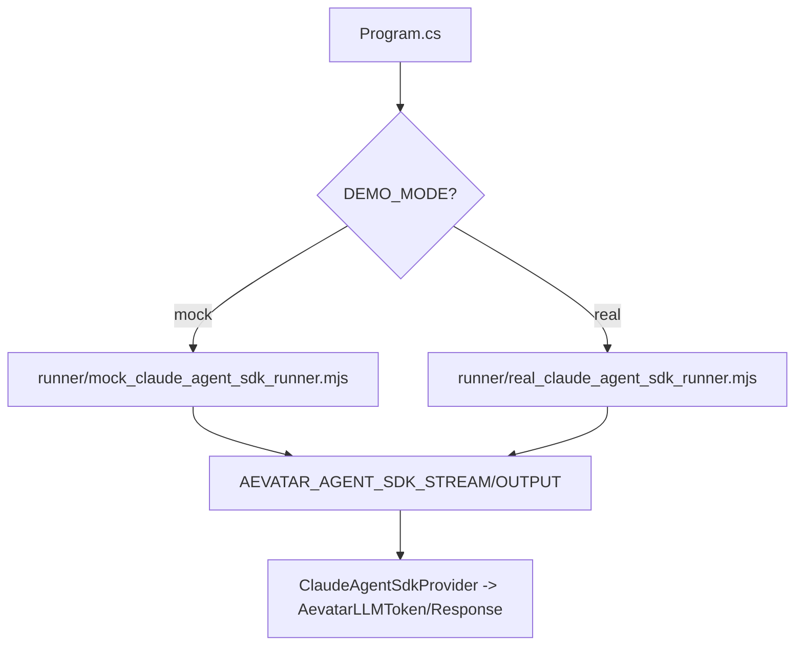

# Design Document

## Overview

本设计在现有 `examples/ClaudeAgentSdkProviderDemo/`（默认 mock 离线演示）基础上，新增 **Real 模式**：通过一个真实的 Node runner 调用官方 **Claude Agent SDK**（`@anthropic-ai/claude-agent-sdk`），并保持与 Aevatar `claude_agent_sdk` provider 的 stdin/stdout marker 协议兼容，从而让 demo 可在真实环境下验证：

- Claude Agent SDK 的 **project settings / CLAUDE.md 加载**（`settingSources: ["project"]`）
- 真实服务的 **streaming**（best-effort，将 SDK message 流映射为 `AEVATAR_AGENT_SDK_STREAM:*`）
- 仍然保持 Aevatar 的 **tool-loop 边界**（Aevatar tools 不映射到 Claude Agent SDK；provider 不返回 `AevatarFunctionCall`）

设计目标：
- **默认仍然离线可跑**（mock 模式不变）
- **真实模式为可选**：开发者安装并配置好 Claude Code runtime + Agent SDK npm 包 + API key 后可启用

## Steering Document Alignment

### Technical Standards (tech.md)

- **Safe by default / secrets hygiene**：
  - 真实模式仅通过环境变量提供 `ANTHROPIC_API_KEY`（或使用 Claude Code 已认证环境）
  - Demo/日志中不得打印 secrets
- **Port Policy**：
  - demo 不启动监听服务；文档不出现 `:5000`，如未来 sidecar（非本规格）默认建议 `:5678`
- **依赖边界**：
  - 真实 runner 的 Node 依赖仅存在于 demo（`examples/`），不引入到 .NET 依赖树

### Project Structure (structure.md)

- 仍遵循 `examples/*Demo/` 结构：`Program.cs` / `README.md` / `appsettings*.json`
- runner 脚本保持在 `examples/ClaudeAgentSdkProviderDemo/runner/`
- 为避免把 npm 依赖安装在 `bin/` 输出目录，本设计在 real 模式下让 runner 从 **repo 源目录**执行（用于 Node module resolution），但将 Claude Agent SDK 的工作目录（`cwd`）指向 **build 输出目录的 demo_project 沙箱**，将潜在文件操作限制在 demo 范围内。

## Code Reuse Analysis

### Existing Components to Leverage

- **`ClaudeAgentSdkProvider`**（已实现）：stdin JSON → runner process → stdout markers → `AevatarLLMResponse/AevatarLLMToken`
- **现有 Demo**：`examples/ClaudeAgentSdkProviderDemo/Program.cs`
  - 已有 baseline/minimal/full 对比输出
  - 已有 streaming 展示
  - 已有对 `ProviderSpecificSettings` 的运行时归一化（避免 binder 形态问题）
- **文档**：`src/Aevatar.Agents.AI.LLMTornado/docs/ClaudeAgentSdkProvider.md`

### Integration Points

- `Program.cs` 增加模式开关：
  - `CLAUDE_AGENT_SDK_DEMO_MODE=mock|real`（默认 mock）
  - real 模式下将 `runnerArgs[0]` 指向 `runner/real_claude_agent_sdk_runner.mjs`
  - real 模式下将 JSON 中的 `settingSources` 设为 `["project"]`（触发 CLAUDE.md 加载）

## Architecture

### Real runner execution model

- **Where script lives**：repo 源码目录下 `examples/ClaudeAgentSdkProviderDemo/runner/real_claude_agent_sdk_runner.mjs`
  - 使 `@anthropic-ai/claude-agent-sdk` 的 `node_modules` 可以在该目录（或父目录）通过 `npm install` 安装并被 Node 解析
- **Where Claude operates**：build 输出目录下的 `demo_project/`（沙箱）
  - runner 将 `options.cwd` 指向该路径
  - runner 将 `settingSources: ["project"]`（由 stdin JSON 驱动）传给 SDK，使其加载项目级 `CLAUDE.md` / `.claude/settings.json`

### Dependencies (real mode)

根据 Claude Agent SDK 文档（Context7）：
- 全局安装 Claude Code runtime：`npm install -g @anthropic-ai/claude-code`
- 本地安装 Agent SDK：`npm install @anthropic-ai/claude-agent-sdk`
- 配置环境变量：`ANTHROPIC_API_KEY=...`

## Components and Interfaces

### `runner/real_claude_agent_sdk_runner.mjs` (new)

- **Purpose:** 调用真实 Claude Agent SDK 并映射输出到 marker 协议
- **Inputs:** stdin JSON（由 `ClaudeAgentSdkProvider` 生成）
- **Outputs:** stdout markers + stderr diagnostic tail（不含 secrets）
- **Core mapping:**
  - `projectRoot` → `options.cwd`
  - `settingSources` → `options.settingSources`
  - `plugins`（string[] paths）→ `options.plugins = [{type:"local", path}]`（best-effort；真实插件结构不在本规格强制提供）
  - `allowedTools`/`permissionMode` → best-effort 映射到 SDK options（可选；默认不 bypass）
  - `messages` → 取最后一个 user message 作为 `prompt`（MVP）
  - streaming：对每个 assistant message 的文本块，输出 `AEVATAR_AGENT_SDK_STREAM:{text}`（best-effort）

### Demo `Program.cs` (modify)

- **Purpose:** 增加 real 模式选择与 README 对齐
- **Behavior changes:**
  - 在 `NormalizeDemoProviderConfigs` 中根据 mode 选择 runner 脚本路径
  - 真实模式下将 `ProviderSpecificSettings.settingSources=["project"]` 注入（让 provider payload 传给 runner）

### `demo_project/CLAUDE.md` (new)

- **Purpose:** 作为真实模式下可观察的“项目级指令”载体
- **Content design:** 使用简单强约束（例如要求输出前缀）以便一眼看出是否生效

## Data Models

### Stdin JSON (existing provider payload; extended)

在现有 payload 基础上，real runner 需要关注字段：

- `projectRoot` (string)
- `settingSources` (string[]; e.g. `["project"]`)
- `plugins` (string[] paths; optional)
- `allowedTools` (string[]; optional)
- `permissionMode` (string; optional)
- `messages` (role/content)
- `stream` (bool)

### Stdout markers (unchanged)

- `AEVATAR_AGENT_SDK_STREAM:{text}`
- `AEVATAR_AGENT_SDK_OUTPUT:{ "content": "...", "meta": {...} }`

## Error Handling

### Error Scenarios

1. **缺少 Node / 模块缺失**
   - **Handling:** runner 捕获 import/exec 错误，stderr 输出可读诊断；.NET demo 输出 remediation steps
2. **缺少 Claude Code runtime / 未鉴权 / API key 缺失**
   - **Handling:** runner 将 SDK 错误输出到 stderr（脱敏）；README 提供安装/鉴权指引
3. **真实模式产生费用**
   - **Handling:** README 明确提示；默认仍为 mock

## Testing Strategy

### Unit Testing

- 不对真实 SDK 调用写自动化单测（需要外网与 key）；保留 mock demo 的离线稳定性。

### Integration Testing

- mock 模式继续 `dotnet run` 离线通过（CI 友好）
- real 模式为手动验证流程（README 给步骤）

### End-to-End Testing

- 人工：设置 `CLAUDE_AGENT_SDK_DEMO_MODE=real` + `ANTHROPIC_API_KEY` 后运行 demo，观察 `CLAUDE.md` 约束是否生效、streaming 是否输出、无 secrets 泄露。

