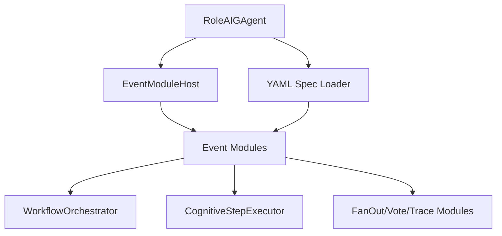

# Design Document

## Overview

本设计将 `EventHandler` 抽象为模块，并由 `RoleAIGAgent` 作为模块宿主。
模块通过 YAML 装配，形成 “可插拔 Coordinator” 能力。

## Steering Document Alignment

### Technical Standards (tech.md)
- 仍遵循 Protobuf-first 契约
- 模块接口放在 `src/Aevatar.Agents.AI.Core`

### Project Structure (structure.md)
- 模块接口/宿主：`src/Aevatar.Agents.AI.Core`
- Cognitive 模块实现：`src/Aevatar.Agents.Cognitive/Execution`
- Spec workflow 文档：`.spec-workflow/specs/event-handler-modules/`

## Code Reuse Analysis

### Existing Components to Leverage
- `RoleAIGAgent`：现有角色驱动 agent
- `WorkflowOrchestrator` / `CognitiveStepExecutor`：已拆分执行逻辑
- `CognitiveStepExecutionHandler`：worker step handler

### Integration Points
- `RoleAgentFactory`：从 YAML 装配模块
- `AIGAgentBase`：提供 PublishAsync/ChatAsync 能力

## Architecture



## Components and Interfaces

### Component 1: `IEventModule`
- **Purpose:** 统一事件模块接口
- **Interfaces:**
  - `Name`, `Priority`
  - `CanHandle(EventEnvelope)`
  - `HandleAsync(EventEnvelope, IEventModuleHost, CancellationToken)`

### Component 2: `IEventModuleHost`
- **Purpose:** 向模块暴露最小宿主能力
- **Interfaces:**
  - `AgentId`
  - `Agent`（AIGAgentBase）
  - `PublishAsync(IMessage, EventDirection)`

### Component 3: `RoleAIGAgent` 模块宿主
- **Purpose:** event handler 聚合与转发
- **Behavior:** `[AllEventHandler]` → 顺序调用模块 → best-effort

### Component 4: YAML 装配器
- **Purpose:** 解析 YAML（extensions 或 spec workflow）并装配模块
- **Integration:** `RoleAgentFactory`（统一装配入口）

## Data Models

### Spec Workflow YAML（示例）
```yaml
extensions:
  event_modules: "workflow_orchestrator,step_executor,fanout,vote,trace,primitives"
  event_routes: |
    - when: event.type == "StartWorkflowRequestEvent"
      to: workflow_orchestrator
    - when: event.type == "ExecuteStepRequestEvent"
      to: step_executor
    - when: event.step_type == "fan_out"
      to: fanout
```

## Error Handling

1. **模块异常**：捕获并 log，不中断主流程。
2. **配置错误**：跳过非法 module / route，记录警告日志。

## Testing Strategy

### Unit Testing
- 模块路由匹配
- 优先级与顺序
- 异常隔离

### Integration Testing
- YAML 装配后运行一个最小 workflow
