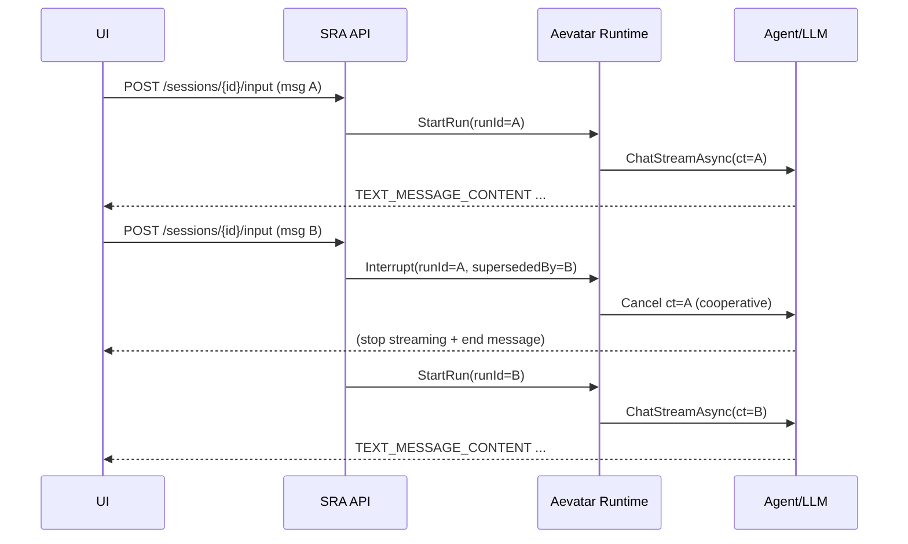

# Design Document

## Overview

本设计在框架层引入“可打断的 Run（Interruptible Runs）”能力：将一次用户输入触发的长任务建模为 Run（具备 `runId`、取消令牌、生命周期与结果），并提供 **Latest-wins** 的抢占策略：同一 scope（通常是 session 或 agent）出现新消息时，旧 run 会被协作式取消并标记为 “superseded”，随后立即开始新 run。

该能力分两层落地：
- **Framework-level primitive（Core + Abstractions + Runtime.*）**：跨运行时一致的 run/cancel 模型与控制事件（Protobuf），不要求业务 Agent 改代码即可享受“不会并发破坏状态”的语义。
- **SRA integration**：将 SRA 当前的 “fire-and-forget run” 改为可取消的 run，且新消息自动打断旧 run（无需重新开 session、无需手动重跑）。

## Steering Document Alignment

### Technical Standards (tech.md)
- **Protobuf-first**：新增跨边界控制消息 `RunControlEvent` 使用 `.proto` 定义（放在 `Aevatar.Agents.Abstractions`），通过 `EventEnvelope.payload` 传输。
- **Runtime agnostic**：控制消息与 runId 传播方式在 Abstractions/Core 定义；Local/Orleans/ProtoActor runtime 适配层实现一致语义。
- **Observability**：复用 AG-UI run/step 事件模型（RUN_STARTED/RUN_FINISHED/RUN_ERROR），新增 CUSTOM 事件用于 UI 立即反馈“被打断/已切换”。

### Project Structure (structure.md)
- Protobuf：`src/Aevatar.Agents.Abstractions/*.proto`
- Core：`src/Aevatar.Agents.Core/` 放置 run manager 与上下文注入
- Runtime：`src/Aevatar.Agents.Runtime.*` 在消息入口处解析 `run_id` 并绑定取消语义
- SRA：`scientific-research-assistant/src/ScientificResearchAssistant.Api/` 仅做薄接入（CTS 管理 + 传递 CancellationToken + UI 事件）

## Code Reuse Analysis

### Existing Components to Leverage
- **`Aevatar.Agents.AGUI/AgUiEvents.cs`**：已有 `RUN_*`、`STEP_*`、`TEXT_MESSAGE_*` 事件体系，可用于 UI 侧呈现“中断/切换 run”的状态。
- **`Aevatar.Agents.AI.Core/AIGAgentBase.Chat.cs`**：`ChatAsync` / `ChatStreamAsync` / tool loop 全面接收 `CancellationToken`，可直接作为协作式取消的执行面。
- **`Aevatar.Agents.Abstractions/abstrations_messages.proto`**：已有 `EventEnvelope`（含 `context_metadata`），可作为 runId 的跨边界传播载体；同时新增 run control message 也落在同一 proto 包。
- **Local runtime mailbox gate（已存在/近期修复）**：同一 actor 串行处理事件，避免“并发修改状态/事件队列”的根因。

### Integration Points
- **Event routing**：`EventEnvelope.context_metadata` 可注入 `run_id`，让事件驱动链路可观测并可被取消。
- **SRA Session**：`ResearchSession` 已有 `RunLock` 串行化；扩展为可取消（持有 active CTS + superseded 状态）即可实现“新消息打断旧 run”。

## Architecture

### High-level flow (Latest-wins)



### Key design choice: cooperative cancel, not “hard kill”

框架不尝试终止线程或强制中止外部 I/O；而是通过 `CancellationToken` 贯穿：
- LLM streaming loop
- tool calling loop
- orchestrator steps（每步边界处检查 token）

取消后的最关键保证：**停止向 UI 输出** + **关闭 message stream** + **返回 run canceled/superseded 状态**。

## Components and Interfaces

### Component 1 — Protobuf control message: `RunControlEvent`

**Purpose:** 作为跨边界控制事件（取消/打断），可通过 `EventEnvelope.payload` 在不同 runtime 之间一致传播。

**Location:** `src/Aevatar.Agents.Abstractions/abstrations_messages.proto`（或新建 `run_control.proto`，但优先保持文件数量不膨胀）。

**Shape (conceptual):**
- `string scope_id`（可选：sessionId/agentId；用于观测）
- `string target_run_id`
- `string superseded_by_run_id`（可选）
- `string action`（CANCEL / SUPERSEDE）
- `string reason`（bounded）
- `google.protobuf.Timestamp ts`

### Component 2 — Core run manager: `IRunManager` + `RunContextScope`

**Purpose:** 提供每 scope 的 active run registry，并生成/持有 CTS；支持 Latest-wins 策略。

**Interfaces:**
- `StartRun(scopeId, runId) => RunContext`
- `Interrupt(scopeId, supersededByRunId, reason) => (oldRunId?)`
- `TryGetActive(scopeId) => RunContext?`

**Implementation notes:**
- 内部用 `ConcurrentDictionary<string, RunContext>`。
- `RunContext` 持有 `CancellationTokenSource`。
- `RunContextScope` 用 `AsyncLocal<RunContext?>` 在一次处理链路中提供“当前 run”给下游（工具/LLM/投影）。

### Component 3 — Runtime integration: bind run context to message processing

**Purpose:** 在 runtime 层（Local/Orleans/ProtoActor）把 runId 与 CTS 绑定到实际执行的 `CancellationToken`，并保证 mailbox 语义。

**Behavior:**
- 当 runtime 处理一个“用户输入触发”的入口（例如 RPC/chat）时，创建 runId 并进入 `RunContextScope`。
- 当收到 `RunControlEvent(CANCEL)` 时：
  - 查找对应 scope 的 active run
  - 调用 CTS.Cancel()
  - 发出运行状态事件（供 UI/日志）

> 注意：runtime 层必须串行处理同一 actor 的控制消息与业务消息，避免竞态（Local runtime 已通过 mailbox gate 达成；Orleans/ProtoActor 各自天然单线程，但仍需显式处理 control event）。

### Component 4 — SRA integration (thin)

**Purpose:** 让 SRA 的 `/input` 新消息具备“打断上一 run”的体验，且不影响现有功能。

**Approach:**
- 在 `ResearchSession` 增加 `ActiveRunId` + `ActiveRunCts`（以及 superseded 信息）。
- `/api/sessions/{id}/input`：
  - 如果有 active run：发 interrupt 事件（AG-UI CustomEvent），Cancel CTS
  - 创建新 CTS，启动新 run（仍保持 `RunLock` 串行，但允许快速取消旧 run）
- 将 CTS.Token 贯穿传入：
  - `ResearchRunExecutor.ExecuteAsync(..., ct)`
  - `VibeOrchestrator.ExecuteOneRoundAsync(..., ct)`
  - `VibeOrchestrator.PlanEditing` 的 `ra.ChatAsync(req, ct)` 已原生支持取消

## Data Models

### RunContext (C#)
```
- scopeId: string              // e.g., sessionId or agentId
- runId: string
- startedAtUtc: DateTimeOffset
- cts: CancellationTokenSource
- supersededByRunId?: string
- reason?: string
```

### RunControlEvent (Protobuf)
```
- scope_id: string
- target_run_id: string
- superseded_by_run_id: string
- action: enum (CANCEL, SUPERSEDE)
- reason: string
- ts: Timestamp
```

## Error Handling

### Error Scenarios
1. **Cancellation during streaming**
   - **Handling:** catch `OperationCanceledException` and treat as normal completion; always close message stream.
   - **User Impact:** 显示“已被新消息打断/已切换到新 run”，旧消息不再继续输出。

2. **Tool execution not cancelable**
   - **Handling:** best-effort stop further tool calls and stop UI output; background call may complete but results ignored for superseded run.
   - **User Impact:** 旧 run 显示 canceled；新 run 正常继续。

3. **Repeated cancel**
   - **Handling:** cancellation idempotent (CTS.Cancel multiple times OK).
   - **User Impact:** 无额外错误。

## Testing Strategy

### Unit Testing
- `IRunManager`：Latest-wins；Cancel idempotent；superseded metadata。
- `RunContextScope`：AsyncLocal 行为正确（nested scope/restore）。

### Integration Testing
- Local runtime：并发输入两次，验证第一次 run 被取消且不再输出（可用测试 agent + deterministic delays）。
- AI streaming：使用 `ChatStreamAsync` mock provider，验证 ct 取消后停止 yield。

### End-to-End Testing
- SRA：启动一个慢的 plan_edit（或模拟慢的 RA call），在其输出中途发第二条输入：
  - UI 收到 interrupt events
  - 第一条 run 结束（RUN_FINISHED/“canceled” 或 RUN_ERROR 但 code=“canceled”）
  - 第二条 run 正常开始并输出


