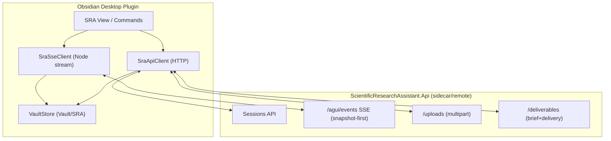

# Design Document

## Overview

本设计在不改动既有 `scientific-research-assistant`（SRA）Web 前后端的前提下，新增一个 **Obsidian Desktop 插件**项目：插件通过 **HTTP + AG-UI SSE** 驱动 SRA 后端（本地 sidecar 或未来远程服务），并把输入材料与输出产物以稳定结构写入当前 vault 的 `SRA/` 目录。

设计原则：

- **插件=UI/本地文件编排**；SRA 后端=**计算/多智能体执行**。
- **面向远程**：插件只依赖 HTTP API（可配置 `baseUrl`），不依赖后端本机文件路径、不使用后端“local-only 文件管理 API”作为主路径。
- **Additive only**：默认不改后端；如未来需要后端增强，只允许新增向后兼容端点/字段。

## Steering Document Alignment

### Technical Standards (tech.md)

- **端口政策**：插件默认连接 `http://localhost:5678`（不使用 `:5000`）。
- **运行时无关**：插件只依赖 SRA 的 HTTP 协议，不依赖 Aevatar 内部运行时（Local/Orleans/ProtoActor）。
- **安全**：插件不保存明文 API key；引导用户使用既有 secrets 机制（`Aevatar.Secrets.Api` / CLI / SRA 本地 secrets API）。

### Project Structure (structure.md)

- 在 `scientific-research-assistant/` 子系统内新增一个独立目录作为 Obsidian 插件项目（例如 `scientific-research-assistant/obsidian-plugin/`），与现有 `frontend/`、`src/ScientificResearchAssistant.Api/` 平行，避免交叉侵入。
- 插件项目内部按职责分层：`api/`（HTTP client）、`sse/`（流式连接）、`vault/`（文件落盘）、`ui/`（视图与命令）。

## Code Reuse Analysis

### Existing Components to Leverage

- **SRA Sessions API**（`src/ScientificResearchAssistant.Api/Sessions/ResearchSessionsApi.cs`）：
  - `POST /api/sessions`（创建会话）
  - `GET /api/sessions`（列举会话）
  - `POST /api/sessions/{id}/input`（触发 run）
  - `GET /api/sessions/{id}/agui/events`（SSE，snapshot-first）
  - `POST /api/sessions/{id}/uploads`（附件上传，返回 `attachmentPaths`）
  - `GET /api/sessions/{id}/deliverables`（brief + delivery 聚合）
- **前端 AG-UI shim**：`scientific-research-assistant/frontend/src/lib/agui-sdk.ts`
  - 复用其“按 `evt.type` 分发”的事件处理思路；Obsidian 插件侧将实现 Node-friendly SSE client，但事件模型保持一致。

### Integration Points

- **SRA 后端**：插件通过 `baseUrl` 访问后端 API；MVP 默认 `http://localhost:5678`。
- **Vault**：插件通过 Obsidian Vault API 读写文件；所有写入限定在 `Vault/SRA/` 子树。
- **Secrets UI**：插件提供跳转到 `Aevatar.Secrets.Api`（默认 `http://localhost:6677`）或提示使用 CLI（不在插件内持久化 key）。

## Architecture

整体采用 “sidecar + thin client”：

- sidecar：`ScientificResearchAssistant.Api` 负责运行/工具调用/SSE 事件流（快照优先）。
- client：Obsidian 插件负责发请求、订阅 SSE、把关键轨迹与交付物写入 `Vault/SRA/`。



### Modular Design Principles

- **Single File Responsibility**：SSE 解析、HTTP 调用、vault 写入、UI 状态分别独立。
- **Component Isolation**：UI 不直接做网络与文件 IO；通过 service 接口注入。
- **Service Layer Separation**：`api/` 只做协议；`vault/` 只做落盘；`ui/` 只做交互与状态。

## Components and Interfaces

### Component 1 — `SraApiClient` (HTTP)

- **Purpose:** 封装对 SRA 后端的 HTTP 调用（create/list/input/uploads/deliverables/health）。
- **Interfaces:**
  - `health(): Promise<{ ok: boolean; info?: any; error?: string }>`
  - `createSession(providerName?: string): Promise<{ sessionId: string }>`
  - `listSessions(): Promise<{ sessions: any[] }>`
  - `sendInput(sessionId: string, input: { message: string; mode?: string; providerName?: string; requestId?: string; attachmentPaths?: string[] }): Promise<{ runId?: string }>`
  - `uploadAttachments(sessionId: string, files: VaultFileRef[]): Promise<{ attachmentPaths: string[] }>`
  - `getDeliverables(sessionId: string): Promise<DeliverablesSnapshot>`
- **Dependencies:** Obsidian 的网络请求能力（优先 `requestUrl`），以及 vault 读取附件内容的能力。
- **Reuses:** 复用 SRA 既有 endpoints 与 JSON DTO 约定。

### Component 2 — `SraSseClient` (AG-UI SSE)

- **Purpose:** 连接 `/api/sessions/{id}/agui/events`，解析 `data: <json>` 行并按 `evt.type` 分发给订阅者。
- **Interfaces:**
  - `connect(sessionId: string, handlers: { onEvent(evt: AgUiEvent): void; onStatus(status: SseStatus): void }): SseConnection`
  - `disconnect(): void`
- **Dependencies:** Node `http/https`（桌面端可用，绕开浏览器 CORS / EventSource 限制），可选支持 `Authorization` header（为远程预留）。
- **Reuses:** 参考 `frontend/src/lib/agui-sdk.ts` 的事件分发模式（按 `evt.type`）。

### Component 3 — `VaultStore` (Vault/SRA writer)

- **Purpose:** 将 run 事件流、deliverables、会话元信息以稳定路径写入 `Vault/SRA/`。
- **Interfaces:**
  - `ensureRoot(): Promise<void>`
  - `appendRunEvent(sessionId: string, runId: string, evt: any): Promise<void>`
  - `writeDeliverables(sessionId: string, snapshot: DeliverablesSnapshot): Promise<void>`
  - `writeRunIndex(sessionId: string, runId: string, meta: RunMeta): Promise<void>`
- **Dependencies:** Obsidian Vault API（创建目录、读写文件、原子写入）。
- **Reuses:** SRA deliverables 的结构（brief + delivery）。

### Component 4 — `SraView` (UI)

- **Purpose:** 侧边栏视图：连接状态、session 选择、消息输入、run 状态、输出落盘提示。
- **Interfaces:** Obsidian `View` + commands。
- **Dependencies:** `SraApiClient` / `SraSseClient` / `VaultStore`。
- **Reuses:** 参考 SRA Web UI 的最小交互（create session → connect SSE → send input → pull deliverables）。

## Data Models

### Model 1 — Plugin settings (`SraPluginSettings`)

```
- baseUrl: string            # default: http://localhost:5678
- vaultRoot: string          # default: "SRA" (within current vault)
- activeSessionId: string    # last selected session
- secretsUiUrl: string       # default: http://localhost:6677 (best-effort)
- requestTimeoutMs: number   # default: 15000
```

### Model 2 — Vault layout

```
Vault/SRA/
  sessions/
    {sessionId}/
      session.json                    # {sessionId, createdAt?, baseUrl?} (best-effort)
      runs/
        {runId}/
          events.jsonl                # append-only raw AG-UI events (one JSON per line)
          run.json                    # {runId, startedAt?, mode?, requestId?, lastStatus?}
      deliverables/
        deliverables.json             # raw response from GET /deliverables
        brief.md                      # derived human-readable brief (best-effort)
        delivery.md                   # derived human-readable summary (best-effort)
```

> 说明：MVP 以 `events.jsonl` 作为“可回放事实”。`brief.md`/`delivery.md` 属于 UI 友好派生物，允许 best-effort 生成失败但不影响 JSON 落盘。

### Model 3 — AG-UI event (subset)

```
- type: string              # e.g., MESSAGES_SNAPSHOT, RUN_STARTED, TEXT_MESSAGE_CONTENT, CUSTOM, ...
- timestamp: number
- ... payload fields depend on type
```

## Error Handling

### Error Scenarios

1. **Backend unreachable / health check fails**
   - **Handling:** API 调用返回结构化错误；UI 显示 offline；不进行 vault 写入。
   - **User Impact:** “Cannot connect to SRA backend. Check baseUrl / start sidecar.”

2. **SSE disconnects mid-run**
   - **Handling:** `SraSseClient` 状态变为 `Disconnected`，指数退避重连；重连成功后继续追加事件；重连期间 UI 提示。
   - **User Impact:** “Stream disconnected, retrying…”，不阻塞用户继续编辑笔记。

3. **Vault write fails (permission / sync lock / path conflict)**
   - **Handling:** 所有落盘为 best-effort；失败时 UI 提示并记录到插件日志；不影响后端 run。
   - **User Impact:** “Failed to write to Vault/SRA. Check permissions or file conflicts.”

4. **Uploads rejected (too big / unsupported type / too many files)**
   - **Handling:** 清晰提示限制；允许用户移除附件后继续发送。
   - **User Impact:** “Upload failed: file too large / unsupported extension / too many files.”

## Testing Strategy

### Unit Testing

- SSE parser：给定 `data: {...}\n\n` 流输入，验证事件分割与 JSON 解析正确。
- Vault path safety：验证任何写入都不会逃逸 `SRA/` 目录（path traversal）。
- Deliverables renderer：将 `brief + delivery` JSON 渲染为 markdown 的纯函数测试（best-effort）。

### Integration Testing

- 本地启动 `ScientificResearchAssistant.Api`（`ASPNETCORE_URLS=http://localhost:5678 dotnet run`）后：
  - 插件创建 session → 发送 input → 订阅 SSE → 验证 `Vault/SRA/sessions/.../events.jsonl` 持续增长。
  - 调用 pull deliverables → 验证 `deliverables.json/brief.md` 写入。

### End-to-End Testing

- 用户场景回归：
  - “New Session → Ask question → Observe streaming → Pull Deliverables → Open generated notes”
  - “Attach current note → Send → Verify uploads referenced in run”


