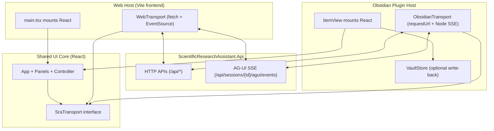

# Design Document

## Overview

本设计把 `scientific-research-assistant/frontend`（React Web UI）的全部能力移植到 **Obsidian Desktop 插件**中，并要求：

- **SRA 后端（`ScientificResearchAssistant.Api`）不变**：仍然提供 HTTP + AG-UI SSE。
- **Web UI 继续可用**：现有 `frontend/` 保持可运行，避免回归。
- **Obsidian UI 完整对齐**：在 Obsidian 内提供聊天 + 所有面板 + Files + API Key 等“功能等价”。

核心策略：把 Web UI 的“业务 UI 代码”抽离为 **可复用的 React UI core**，并通过 **transport 抽象**在不同宿主环境复用同一套 UI：

- Web 宿主：`fetch + EventSource`（保持现有行为，Vite proxy 解决 CORS）
- Obsidian 宿主：`requestUrl + Node SSE`（绕开 CORS，复用现有 `obsidian-plugin` 的 `SraApiClient` / `SraSseClient`）

## Steering Document Alignment

### Technical Standards (tech.md)

- **端口政策**：所有默认/示例端口使用 `5678`，避免 `:5000`。
- **运行时无关**：UI 只依赖后端 HTTP/SSE 协议；Aevatar runtime 演进不影响 UI。
- **安全**：插件不在设置中持久化明文 API key；通过后端 secrets API 或外部 Secrets UI/CLI 完成密钥写入（与现有 `ApiKeyModal` 逻辑一致）。

### Project Structure (structure.md)

- 保持 `scientific-research-assistant/frontend` 与 `scientific-research-assistant/src/ScientificResearchAssistant.Api` 的边界不变。
- Obsidian 插件继续位于 `scientific-research-assistant/obsidian-plugin/`。
- 新增一个共享 UI 目录/包（建议：`scientific-research-assistant/ui/` 或 `scientific-research-assistant/packages/sra-ui/`）：
  - 仅存放“可复用 React UI + controller + types”，不包含宿主特有代码
  - Web 与 Obsidian 各自提供宿主层 entry（mount + transport 实现）

> 该共享目录属于架构级新增：实现阶段会同步更新 `scientific-research-assistant/docs/` 中的架构说明（见 tasks）。

## Code Reuse Analysis

### Existing Components to Leverage

来自 Web UI（`scientific-research-assistant/frontend/src`）：

- **`app/useAppController.ts`**：当前的 UI 核心状态机（session 列表、SSE 连接、message store、各面板快照、skills sync、mcp reconnect 等）。
- **`app/messageStore.ts` + `app/messageId.ts` + `components/ChatMessageRow.tsx`**：聊天呈现与多 agent 输出的筛选/折叠行为。
- **Panels**：
  - `panels/Composer.tsx`（mode/provider/toAgents/files）
  - `panels/GoalsPanel.tsx`（GET/PUT goals）
  - `panels/BriefPanel.tsx`（brief snapshot + refresh）
  - `panels/DagPanel.tsx`（dag snapshot + explain + open graph）
  - `panels/TracePanel.tsx`（trace 列表 + 文件链接）
  - `panels/DeliveryCenterPanel.tsx`（delivery snapshot + 文件路径展示）
  - `panels/ComputePanel.tsx`（compute decision）
  - `panels/ApiKeyModal.tsx`（LLM providers/models/test/key set/remove）
- **`pages/FilesPage.tsx`**：session workspace 的文件树/编辑/保存（local-only）。
- **`lib/agui-sdk.ts`**：AG-UI SSE 客户端 shim（Web 侧基于 `EventSource`）。

来自 Obsidian 插件（`scientific-research-assistant/obsidian-plugin/src`，已实现基础能力）：

- **`api/SraApiClient.ts`**：`requestUrl` 版 HTTP 客户端（/sessions、/input、/deliverables、/uploads、/info）。
- **`sse/SraSseClient.ts` + `sse/sseParser.ts`**：Node http/https SSE 客户端（断线退避重连）。
- **`vault/VaultStore.ts`**：将事件与交付物写回 `Vault/SRA/`（可作为 Obsidian 侧额外能力，不影响 Web）。

### Integration Points

- **SRA 后端 endpoints（既有）**：`/api/sessions/*`、`/api/skills/*`、`/api/llm/*`、`/api/secrets/*`、`/health`、`/api/info`。
- **Obsidian runtime**：通过 `ItemView`/`WorkspaceLeaf` 提供容器并挂载 React；网络请求用 `requestUrl`；SSE 用 Node http/https；文件读写走 Vault API。

## Architecture

### High-level

### Key design decision: transport abstraction

当前 Web UI 直接调用 `fetch("/api/...")` 并用 `EventSource("/api/sessions/{id}/agui/events")`。在 Obsidian 中：

- `fetch("/api")` 没有 Vite proxy（且 origin 不同）
- `EventSource("http://localhost:5678/...")` 会遇到 CORS/环境差异

因此必须把“网络与 SSE”抽象出来，让 UI 逻辑不关心运行环境。

## Components and Interfaces

### Component 1 — `SraTransport` (new, shared)

- **Purpose:** 统一 Web/Obsidian 的后端交互（HTTP + SSE + uploads）。
- **Interfaces (conceptual):**
  - `getInfo()`
  - `listSessions() / createSession()`
  - `sendInput(sessionId, payload)`
  - `getTools(sessionId) / getGoals(sessionId) / putGoals(sessionId, body)`
  - `getDeliverables(sessionId)`
  - `getDag(sessionId) / explainDagNode(sessionId, nodeId)`
  - `getWorkspace(sessionId)`
  - `uploads(sessionId, files[]) -> attachmentPaths`
  - `connectAgUi(sessionId, onEvent, onStatus) -> close()`
  - `skillsSync()` + `skillsSyncStatus()`
  - `llmProviders/models/test/apiKey set/remove`（调用后端 secrets/llm endpoints）
- **Dependencies:** 在宿主层实现（WebTransport / ObsidianTransport）。

### Component 2 — `WebTransport` (new, web-only)

- **Purpose:** 保持现有行为：相对路径 `/api/...`，SSE 使用 `EventSource`。
- **Dependencies:** `fetch`, `EventSource`, Vite proxy（`SRA_API_PROXY_TARGET`）。

### Component 3 — `ObsidianTransport` (new, plugin-only)

- **Purpose:** 在 Obsidian 内稳定工作：
  - HTTP：`requestUrl`（可配 `baseUrl`）
  - SSE：复用 `SraSseClient`
  - uploads：复用 multipart builder + `requestUrl`
- **Dependencies:** Obsidian API（`requestUrl`）+ Node http/https。

### Component 4 — `SraWorkbenchApp` (shared React root)

- **Purpose:** 用同一套 UI（聊天 + 面板 + Files）驱动 `SraTransport`。
- **Notes:** 现有 `App.tsx` + `useAppController.ts` 将被改造为“宿主无关”：
  - 移除 `window.location` 强依赖（或集中到 host adapter）
  - 将所有 `fetch(...)` 与 `AgUiClient(...)` 改为 `transport.*`
  - 保留原有 UX：scroll、agent filter、collapsed messages、tools/workspace modals、api key modal、skills sync logs

### Component 5 — `ObsidianSraWorkbenchView` (plugin host)

- **Purpose:** Obsidian `ItemView` 容器，创建 React root 并渲染 `SraWorkbenchApp`。
- **Additional capability:** 可选将关键事件/交付物写回 `Vault/SRA/`（基于 `VaultStore`），便于笔记化沉淀。

## Data Models

### Model 1 — UI State (derived from current `useAppController`)

保持当前 Web UI 的状态结构（message store、tools snapshot、workspace snapshot、vibe snapshots、skills sync logs、run steps）。

### Model 2 — Capability flags (host-provided)

为“local-only endpoint（files API / key reveal）”提供显式能力位：

- `capabilities.filesApi: boolean`
- `capabilities.revealApiKey: boolean`
- `capabilities.nodeSse: boolean`

用于在 UI 层进行明确降级展示（而不是 silent failure）。

## Error Handling

### Error Scenarios

1. **Backend unreachable**
   - **Handling:** transport 返回结构化错误；UI 显示 offline；阻止发送与面板 refresh。
   - **User Impact:** 清晰提示检查 `baseUrl`/sidecar 是否启动。

2. **SSE disconnect**
   - **Handling:** ObsidianTransport 走指数退避重连；WebTransport 走 EventSource 默认重连（并以现有逻辑提示）。
   - **User Impact:** 状态条显示 “Disconnected / retrying”。

3. **Local-only endpoints in remote mode**
   - **Handling:** capabilities 禁用 + UI 提示“仅本地 sidecar 支持”。
   - **User Impact:** 面板按钮 disabled + tooltip。

4. **Secrets/LLM endpoints restricted**
   - **Handling:** 对 reveal/key 相关能力默认仅 loopback 允许；远程默认禁用。
   - **User Impact:** 可设置 key（写入）但不可显示明文；显示原因提示。

## Testing Strategy

### Unit Testing

- transport 层：JSON 解析、错误映射、SSE 事件分发（复用现有 sseParser 测试）。
- UI 纯函数：消息过滤/折叠逻辑、工具列表过滤等。

### Integration Testing

- Web：现有 `frontend` dev/build 不回归（Vite + proxy）。
- Obsidian：在 desktop 环境加载插件并验证端到端：
  - create session → connect SSE → chat streaming → tools/workspace modal → goals save → pull deliverables → files browse（本地）。

### End-to-End Testing

- 桌面用户主路径回归：1 个 session 从创建到交付物落盘与回放（包含 vibe panels）。

