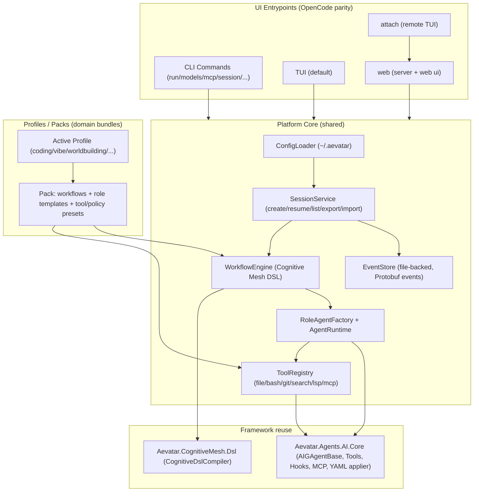

# Design Document

## Overview

本设计文档描述 “Aevatar Platform” 的技术实现方案。**它不是单一的编程助手**，而是一套“Agent OS / Agent Workbench”：
- **基础 UX 标准：CLI/TUI 1:1 对标 OpenCode**（命令/flags/交互语法），作为所有场景的统一入口与可脚本化接口（参考：[OpenCode CLI](https://opencode.ai/docs/cli/)、[OpenCode TUI](https://opencode.ai/docs/tui/)）。
- **核心差异化：多 Agent + DSL 编排**：用 Cognitive Mesh DSL 表达拓扑/约束，用 role YAML 表达“每个角色怎么跑”，把“编程 / vibe researching / 小说世界观 / …”变成可装配的 **Profile/Pack**（workflow+roles+tools+policies 的套件），而不是写死在产品边界里。
- **本地优先**：配置与敏感信息落 `~/.aevatar/`；会话持久化以事件溯源为主（File-backed event store），不同 profile 共用同一会话/存储/安全模型。

## Steering Document Alignment

### Technical Standards (tech.md)
- **.NET 10 / C#**：Platform 以 .NET 10 为目标运行时；依赖版本统一走 `Directory.Packages.props`（CPM）。
- **Protobuf-first**：任何跨边界（会话事件、持久化事件、跨进程/attach 传输）类型必须用 Protobuf 定义并生成代码（遵循仓库铁律）。
- **Runtime agnostic**：核心编排逻辑尽量不绑定某个 runtime；MVP 以 Local runtime 跑通，后续可切 Orleans/ProtoActor。
- **Port policy**：仓库内默认/示例配置 **禁止使用 `:5000`**；涉及 server 端口时，默认选择可配置端口且不得是 `5000`。

### Project Structure (structure.md)
Platform 目前仅有 `platform/docs/*`，代码将新增到 `platform/src/`（保持 monorepo 结构清晰、职责明确、单文件 ≤ 800 行、单层目录 ≤ 8 文件的约束）。

## Code Reuse Analysis

### Existing Components to Leverage
- **`Aevatar.Agents.AI.Core`**：
  - `AIGAgentBase`：LLM 调用、history、tool loop（含 MCP/skills/hook pipeline）。
  - `GlobalAgentYamlRegistry` + `AgentYamlConfigApplier`：加载并应用 `~/.aevatar/agents/{role}.yaml`（role→模型/提示词/tools/skills baseline allowlist）。
  - Hooks/Harness：将稳定性/预算治理/工具输出治理从业务 Agent 中抽离（best-effort）。
- **`Aevatar.CognitiveMesh.Dsl`**：
  - `CognitiveDslCompiler` + `MeshDefinition`：解析/验证 DSL（结构+语义规则集）。
  - 语义校验规则：allowedAgentTypes / allowedConstraintTypes（可按 Platform 白名单收敛）。
- **SRA 的 Mesh 集成模式（参考实现）**：
  - `MeshCompilerService`：支持 YAML→JSON 的 deterministic coercion，且把全局 roles 合并进 allowlist。
  - “compile ok / compile errors structured return（不抛）” 的 API 体验与 best-effort 可观测事件模式。

### Integration Points
- **Agent system**：Platform 的 workflow engine 负责 “创建 Agent actor → 注入/初始化 → 应用 role YAML → 建立 edges 关系 → 驱动执行”。
- **Storage**：Platform 需要一个 file-backed 的 `IEventStore`（用于会话事件溯源与恢复），并遵循 Protobuf 契约。
- **Domain packs（新增概念）**：Platform 以“Pack”承载具体助手能力（例如 vibe researching、worldbuilding、coding），Pack 只提供 DSL/workflows、role YAML 默认模板、tool/policy 组合与可选的 domain UI 面板；**不改变** CLI/TUI 的基础交互范式。

## Architecture

核心思路：把 OpenCode 的 CLI/TUI/Server 看作 **不同 UI 入口**，它们共享同一套 Platform Core（配置、会话、workflow、agents、tools），从而避免两套实现分叉。
在 Core 之上引入 **Profiles/Packs**：
- **Profile**：用户当前“要解决什么类型的任务”的选择（例如 `coding`、`vibe`、`worldbuilding`），对应一个默认 workflow + 默认 role/tool/policy 组合。
- **Pack**：可分发/可安装的能力包（workflow DSL + role 模板 + 可选 domain 扩展），用于把 Platform 从“编程助手”扩展为通用多智能体工作台。

### Modular Design Principles
- **单一事实源**：配置（`~/.aevatar`）、会话事件、workflow DSL 都必须有唯一来源；UI 只投影，不持久化业务真相。
- **可替换边界**：Provider/Tool/MCP/Runtime 为可替换模块；Platform Core 只做 orchestration。
- **防分叉**：CLI/TUI/Server 的行为通过同一套 command spec 与同一套执行管线实现（避免“一个入口一个逻辑”）。

## Components and Interfaces

### Component 1 — CLI Host（System.CommandLine）
- **Purpose:** 提供与 OpenCode CLI 对标的命令/flags/输出格式（human table vs json events）。
- **Interfaces:**
  - `aevatar [project]` / `aevatar tui`：启动 TUI
  - `aevatar run ...`：非交互模式执行
  - `aevatar serve` / `aevatar web`：启动 server（headless / web）
  - `aevatar attach <url>`：附加到远端
  - `aevatar models|mcp|agent|session|stats|export|import|acp|upgrade|uninstall|auth ...`
- **Dependencies:** `PlatformCore`, `ConfigLoader`, `SessionService`
- **Reuses:** `System.CommandLine`（Feasibility 建议）、统一日志与错误模型

### Component 1.5 — Profiles / Packs（域能力装配层）
- **Purpose:** 让 Platform 从“编程助手”扩展为通用多智能体工作台：通过选择 profile/安装 pack 来切换不同的默认 workflow、角色集合、工具策略与（可选）domain UI。
- **Key rules:**
  - **不改基础 CLI/TUI**：OpenCode parity 的命令与交互是底座；profile 只改变“默认 workflow/role/tool policy”。
  - **可脚本化**：profile 选择必须可通过 CLI flag/env/config 指定（例如 `--profile vibe`），且可在 session 内持久化。
  - **Pack 内容是数据优先**：优先以 `~/.aevatar/workflows/*.json|yaml` + `~/.aevatar/agents/*.yaml` 表达；少量需要强结构的域能力再用 code plugin（后续阶段）。

### Component 2 — TUI App（Spectre.Console）
- **Purpose:** 提供 OpenCode 风格的终端 UI：消息输入、流式输出、状态/工具卡片、快捷键与 slash commands。
- **Key behaviors (parity):**
  - `@` 文件引用：模糊搜索→attach 到 message
  - `!` shell：执行→输出进入上下文（受安全策略）
  - `/` commands：help/sessions/themes/editor/…（命令集对标）
  - `/editor`：外部编辑器（`EDITOR` env）
- **Dependencies:** `PlatformCore`（同一会话执行管线）、`ToolRegistry`（用于 `!`）

### Component 3 — Server Host（serve/web/attach）
- **Purpose:** 支撑 `serve`/`web` 与 `attach` 的远程交互（TUI 连接到远端 backend）。
- **Protocol choice:** 初期采用 HTTP + SSE/WS（design 里明确一条实现并锁死），并提供 basic auth（参考 OpenCode 的 `OPENCODE_SERVER_PASSWORD` 语义；Platform 可提供 `AEVATAR_SERVER_PASSWORD` 并允许兼容同名 env）。
- **Port defaults:** 默认端口必须可配置且不得是 `5000`；文档与示例端口优先 `5678`（或与 OpenCode 示例兼容端口，如 `4096`），以 Port policy 为硬约束。

### Component 4 — ConfigLoader（`~/.aevatar`）
- **Purpose:** 加载 `config.yaml` + `secrets.yaml` + `agents/*.yaml` + `workflows/*.json|yaml` + `mcp/servers.yaml`。
- **Interfaces:**
  - `LoadEffectiveConfig()`：合并默认值 + 文件 + env overrides（env 清单在 tasks 阶段固化）
  - `EnsureScaffold()`：`aevatar config init` 创建模板
- **Security:** secrets 只允许来自 `secrets.yaml`（或 env），禁止写入日志与会话事件。

### Component 5 — WorkflowEngine（Cognitive Mesh DSL）
- **Purpose:** 编译/验证 mesh DSL 并执行（role nodes + edges）。
- **Key design:**
  - DSL 编译：复用 `CognitiveDslCompiler`，并用 Platform allowlists 限制 `node.type`/`constraint.type`。
  - YAML DSL 支持：可复用 SRA 的 “YAML→JSON coercion” 方案，保证 deterministic。
  - `node.type = role`：`type` 直接映射到 `~/.aevatar/agents/{role}.yaml`，并合并入 allowedAgentTypes（与 SRA 一致思路）。
- **Execution:** 将 mesh 转换为一个执行计划（顺序/并行策略由 StrategyKind 决定，MVP 可先做 `cot` 线性 + `maker` 共识环）。

### Component 6 — RoleAgentFactory & AgentRuntime
- **Purpose:** 根据 role 创建/复用 agent，并应用 role YAML。
- **Key rules:**
  - 默认用一个通用 `RoleAIGAgent`（继承 `AIGAgentBase`）承载绝大多数角色（coder/reviewer/tester/debug/search/docs/judge/router）。
  - 少数需要强结构的角色可以专用 agent class，但仍必须是 Protobuf state/config。
  - 所有工具权限受 “baseline allowlist + execution-side policy” 双重约束（defense in depth）。
  - **域扩展通过 role 实现**：vibe researching / worldbuilding 等应优先通过新增 role + workflow 来实现（例如 `research_assistant`、`worldbuilder`、`lore_keeper`），避免为每个域复制一套 runtime。

### Component 7 — EventStore（File-backed Event Sourcing）
- **Purpose:** 满足 `session list/show/resume/export/import` 等命令，并支撑 crash 恢复。
- **Implementation direction:**
  - 在 `platform/src` 内新增一个 file-backed `IEventStore` 实现（或沉淀到 `src/Aevatar.Agents.Persistence.*` 作为通用能力）。
  - 事件以 Protobuf message 存储（建议 JSONL：每行 `{timestamp,type,base64(payload)}`，并带版本字段，便于兼容与 debug）。

## Data Models

### Protobuf contracts（必须）
以下类型跨边界（持久化/attach/stream）必须用 Protobuf 定义（示例名，具体字段在 tasks 阶段落到 `.proto`）：
- `PlatformSessionState`：会话当前状态（工作目录、选中 workflow、provider/model、attached files 等）
- `PlatformSessionEvent`：
  - `UserMessageEvent`
  - `AgentOutputDeltaEvent`（流式 token）
  - `ToolExecutionStartedEvent` / `ToolExecutionFinishedEvent`
  - `WorkflowStepStartedEvent` / `WorkflowStepFinishedEvent`
  - `ErrorEvent`
- `PlatformConfigSnapshot`（可选：用于 `config show` 的输出快照；注意 secrets 脱敏）

### DSL models（已存在）
DSL 的 in-memory 结构复用：
- `MeshDefinition` / `NodeSpec` / `EdgeSpec` / `ConstraintSpec`（来自 `Aevatar.CognitiveMesh.Dsl`）

## Error Handling

### Error Scenarios
1. **DSL 编译失败（结构/语义校验）**
   - **Handling:** 返回结构化错误（code/message/path），并在 TUI/CLI 显示可读摘要；在 server 模式下返回 4xx。
   - **User Impact:** 用户看到具体字段路径与建议修复；不启动 workflow 执行。

2. **工具被策略拒绝（权限/allowlist/危险工具关闭）**
   - **Handling:** 在 tool 执行前拒绝并产出 `ToolDenied` 事件；不崩溃主流程。
   - **User Impact:** 明确提示“被策略拒绝”的原因与如何开启（若允许）。

3. **Provider 不可用（缺 key / endpoint 不通）**
   - **Handling:** fail-fast（该调用失败），输出可定位错误；允许用户切换 provider/model 或改用 Ollama。
   - **User Impact:** 得到明确错误与建议的下一步命令（如 `auth login` / `models`）。

4. **attach 连接失败 / 鉴权失败**
   - **Handling:** attach 失败不破坏本地会话；server 返回 401/403 并提示如何设置 password。
   - **User Impact:** 清晰的重试路径与诊断信息。

## Testing Strategy

### Unit Testing
- CLI 命令解析（flags/默认值/互斥关系）与 OpenCode parity 的“黄金用例”（golden tests）。
- ConfigLoader：文件缺失/合并/脱敏/环境变量覆盖。
- DSL 编译：role allowlist 合并、YAML→JSON coercion、典型错误 path 输出。

### Integration Testing
- `aevatar run`：在本地跑最小 workflow（standard、code-review）并生成事件流。
- `serve` + `attach`：启动 server 后 attach TUI 的基本连通性与鉴权。
- Session lifecycle：create/resume/export/import 的端到端测试（file-backed event store）。

### End-to-End Testing
- OpenCode parity checklist：对照 [OpenCode CLI](https://opencode.ai/docs/cli/) 与 [OpenCode TUI](https://opencode.ai/docs/tui/) 的“行为级”脚本（命令输出、交互语法、快捷键/命令可发现性）。
- Profiles/Packs smoke：切换 `coding/vibe/worldbuilding` profile 时，至少验证“不同默认 workflow/roles/tools policy 生效”且仍满足同一 CLI/TUI 命令面。

