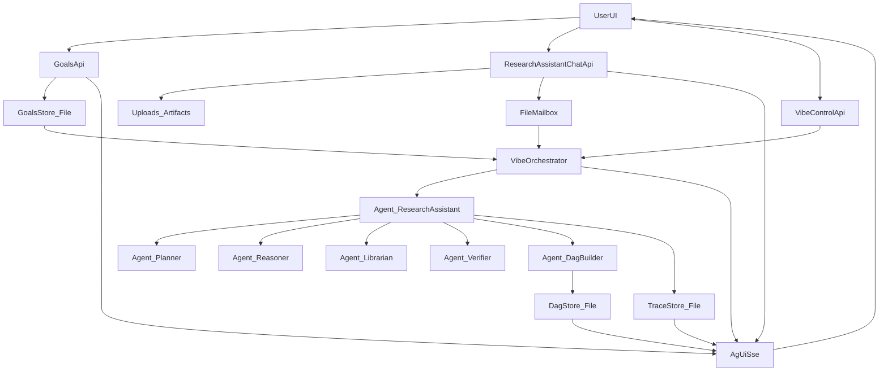

# Design Document

## Overview

本设计将 `scientific-research-assistant` 扩展为一个 **Vibe Researching 平台（单人研究工作台）**。核心 UX 是：**用户默认只跟一个 `research_assistant` 聊天**，由它统筹全局并协调后台多个岗位型 agents。

- **Single chat entrypoint**：用户只维护一条对话线程（`research_assistant`）；可选在同一输入框里指定路由目标，但 UI 不需要多聊天线程。
- **Background multi-agent**：planner/reasoner/librarian/verifier/dag_builder 等作为后台协作 workers，输出通过 Activity/Trace/DAG 面板可见、可审阅。
- **Human-in-the-loop (HITL)**：方向层（goals/中断/暂停/单轮推进）。DAG 写入不走人工逐条审批，而走 **MAKER v2 多 agent 共识**（vote + red-flagging）自动合入知识库。
- **DAG output**：类似 `cognitive-mesh/Aevatar.AxiomReasoning` 的 node/edge 模型表达“推导图”，提供 explain（deps/missing/cycle/provable）。
- **Derivation Trace**：每轮结束自动生成结构化总结（jsonl）+ 人类可读摘要（md），确保推导脉络可追溯、可回放。
- **File-SSoT**：Goals / DAG / Trace / Mailbox 以文件为真相源；前端与内存只做投影（AG-UI SSE）。

> MVP：单人、Local runtime、无复杂权限；但契约（Protobuf）与文件结构为未来扩展留出口。

## Steering Document Alignment

### Technical Standards (tech.md)

- **Protobuf-first**：跨 agent 边界（mailbox、共享资料库 artifacts）使用 Protobuf 契约（`.proto`），落盘用 Protobuf-JSON 便于 review/diff。
- **Best-effort 边界层**：SSE/投影层不允许抛异常杀进程（沿用 `BroadcastEventHub` 的防御性设计）。
- **Dangerous tools default-off**：例如 python_exec 必须显式开启，并在 UI 标识。
- **Port policy**：默认端口保持为 `5678`（仓库禁止 `:5000`）。

### Project Structure (structure.md)

- 子系统落点保持在 `scientific-research-assistant/` 内，避免污染框架核心库 `src/`。
- File-SSoT 统一使用 `workspace/sessions/{sessionId}/...` 作为 session scope 的黑板，目录职责清晰（decisions/mailbox/artifacts/runs）。

## Code Reuse Analysis

### Existing Components to Leverage

- **`scientific-research-assistant/src/ScientificResearchAssistant.Api/Sessions/ResearchSessionManager.cs`**
  - sessionId/runId、AG-UI event hub（SSE fan-out）、消息快照（reconnect 稳定）。
- **`scientific-research-assistant/src/ScientificResearchAssistant.Api/Sessions/ResearchSessionsApi.cs`**
  - sessions/tools/input/agui/events 的基础 API 与“快照优先”SSE 策略。
- **`scientific-research-assistant/src/ScientificResearchAssistant.Api/Sessions/ResearchRunExecutor.cs`**
  - `mode=vibe` 的多 agent 雏形与 tool progress → AG-UI 投影逻辑（继续演进为 orchestrator 驱动）。
- **`scientific-research-assistant/src/ScientificResearchAssistant.Api/Workspace/WorkspaceService.cs`**
  - workspace 路径、安全校验（within-root）、有界扫描（UI snapshot）。
- **`scientific-research-assistant/src/ScientificResearchAssistant.Api/Workspace/FileMailboxService.cs`**
  - durable file queue + Protobuf Any envelope（Send/TryDequeue/Ack/DeadLetter）。
- **`scientific-research-assistant/src/ScientificResearchAssistant.Api/Facts/FactLifecycleService.cs`**
  - proposed→decisions(vote/verify)→final/promote 的 HITL 模式与 Protobuf-JSON 落盘范式（复用到 DAG proposals）。
- **`scientific-research-assistant/src/ScientificResearchAssistant/Vibe/*`**
  - `VibePlannerAgent`/`VibeReasonerAgent`/`VibeAgentBase` 继续复用为后台岗位 agents。
- **`cognitive-mesh/Aevatar.AxiomReasoning/Graph/InMemoryGraphStore.cs`**
  - explain 算法可迁移到 file-based DAG store（语义对齐）。

### Integration Points

- **AG-UI SSE**：继续使用 `GET /api/sessions/{id}/agui/events`，bootstrap 快照追加 goals/dag/trace/agents 状态。
- **Materials**：继续沿用 `MaterialsService`（facts + sources），并允许用户上传文件作为 session artifacts。
- **Mailbox**：用户输入（路由后）与 agent-to-agent 协作统一落到 mailbox，形成可审计的“研究通信总线”。

## Architecture

系统将研究过程组织为 **Round（轮次）**。每轮由 goals 变更 / 用户消息（interrupt）/ 自动 tick 触发，`research_assistant` 作为唯一入口与唯一决策者，统筹后台 workers，产出 DAG 增量与 Round Summary（Trace），并通过 AG-UI SSE 实时投影。



### Round lifecycle（轮次生命周期）

- **触发源**：
  - goals 更新（强制校准；可配置是否立即启动新一轮）
  - 用户消息（默认视为 interrupt）
  - 自动 tick（可配置、可暂停）
  - 用户手动点击 “Run one round”
- **轮次内步骤（示例顺序，允许并行）**：
  1. `research_assistant`（调度阶段）汇总上下文（goals + DAG + trace + 材料）→ 拆分 backlog → 分派给后台 agents（coordinator 职责）
  2. `planner` 产出可执行计划/实验/证据需求
  3. `reasoner` 产出推理结论（要求引用证据或标注假设）
  4. `librarian` 归档材料与证据线索（可写 facts_proposed/、整理 sources 指针）
  5. `verifier` 对关键结论做 hard verification（可选 python_exec）
  6. `dag_builder` 调用 **MAKER v2 共识流程**（`src/Aevatar.Agents.Cognitive/workflows/maker-v2.yaml`）生成/校验 `SraDagMutation`，共识达成后自动合入 DAG
  7. `research_assistant`（总结阶段）生成本轮总结（Trace）

> 注：`research_assistant` 是同一个 agent，在一轮的开头负责统筹/分派，在一轮的结尾负责总结；不是两个不同 agent。

### CPU interrupt 语义（用户中断）

用户消息默认被视为 interrupt：

- **调度层**：orchestrator 将新消息写入 mailbox，并标记当前轮次为 “interrupted”。
- **决策层**：`research_assistant` 决定“立即停掉当前轮 / 合并为下一轮输入 / 仅局部纠偏某些 workers”。
产出的 Trace 必须记录“本轮被中断/纠偏”的原因与后续重排结果。

### Human-in-the-loop（HITL）设计

HITL 主要聚焦在“方向控制”，而不是“逐条审批知识写入”：

1. **方向层（always-on）**
   - 用户可随时编辑 goals（触发全体校准）。
   - 用户通过单入口对话给 `research_assistant` 发送纠偏消息与文件；可选路由给后台 agents（但 UI 不创建多聊天线程）。
   - 用户可暂停/继续自动 tick，或切换为“单步/单轮推进”。

2. **产出层（共识门控，默认开启）**
   - DAG 增量不走人工审批，而由 `dag_builder` 调用 **MAKER System v2（maker-v2）** 执行“fan-out propose → vote → red-flagging 修复”的共识流程。
   - 共识达成：自动写入 DAG snapshot；并把共识摘要写入 Trace（便于复盘）。
   - 未达成共识：不合入最终 snapshot，但保留候选 artifact，并在 Trace 中标记 blocked（缺证据/需补材料/需改 goals），由用户通过“方向层”继续推动下一轮。

> 这样既能建立海量知识库，又避免把单次 LLM 噪声直接写进 DAG。

### research_assistant vs coordinator：是否冲突？

会冲突的前提是“存在两个同级决策者”。本设计默认采用 **单一权威**：

- **`research_assistant` 是唯一对外决策者**：所有用户输入只进入它；所有会改变全局状态的动作（goals 更新、DAG 合并、暂停/继续）只能由它（或用户 API）触发。
- **`coordinator` 不作为独立对话 agent 暴露**：其职责默认合并为 `research_assistant` 的一部分（统筹/分派）。

如果未来确实需要独立的 `coordinator_worker`（为了可替换/并行探索），必须满足：
- 只能产出建议/任务与 proposal
- 不能直接写最终 DAG/decisions
- `research_assistant` 必须对其输出做归并与门控

## Components and Interfaces

### Component 1 — GoalsStore

- **Purpose:** 维护 session goals 的 File-SSoT（增删改）、版本化写盘、供 agents 校准读取。
- **On-disk:** `workspace/sessions/{sessionId}/decisions/goals.json`（Protobuf-JSON）
- **Interfaces:**
  - `GetGoals(sessionId) -> SraGoalsSnapshot`
  - `PutGoals(sessionId, snapshot, actor) -> SraGoalsSnapshot`
  - `BroadcastGoalsUpdated(sessionId, snapshot)`（写 mailbox / 发 SSE）
- **Reuses:** `WorkspaceService` 的 within-root 校验与原子写 tmp→move 范式。

### Component 2 — UploadsStore

- **Purpose:** 保存用户上传文件到 session workspace，返回可给 agents 消费的相对路径引用。
- **On-disk:** `workspace/sessions/{sessionId}/artifacts/uploads/...`
- **Interfaces:** `SaveUpload(sessionId, file) -> attachment_path`
- **Security:** 白名单扩展名 + 大小上限 + within-root 校验。

### Component 3 — FileMailboxService (existing)

- **Purpose:** durable file queue，实现 user→agent / agent→agent 的可靠投递、单消费者处理与 dead-letter。
- **Interfaces:** `Send`, `TryDequeue`, `Ack`, `DeadLetter`
- **Reuses:** Any type registry（`SraCollabReflection.Descriptor`）扩展新增消息类型。

### Component 4 — DagStore (file-based)

- **Purpose:** 维护 DAG 的 event+snapshot，并提供 explain。
- **On-disk:**
  - staged candidates (no consensus): `workspace/sessions/{sessionId}/artifacts/dag/staged/*.json`
  - final snapshot: `workspace/sessions/{sessionId}/artifacts/dag/snapshot.json`
  - consensus logs: `workspace/sessions/{sessionId}/artifacts/dag/consensus/*.json`
- **Interfaces:**
  - `GetSnapshot(sessionId) -> SraDagSnapshot`
  - `ApplyMutation(sessionId, mutation, mode) -> (snapshot_or_delta)`
  - `Explain(sessionId, nodeId) -> SraDagExplain`
- **Algorithm:** 迁移 `Aevatar.AxiomReasoning.Graph.InMemoryGraphStore` 的 explain 逻辑，保持语义一致。

### Component 4.5 — DagConsensusRunner (MAKER v2)

- **Purpose:** 使用 `maker-v2` workflow 对 DAG mutation 进行多 agent 共识生成与 red-flagging 修复。
- **Workflow:** `src/Aevatar.Agents.Cognitive/workflows/maker-v2.yaml`
- **Inputs:** `task`（要求输出 DAG mutation 的严格 JSON 格式）+ `context`（goals/材料引用/当前 DAG 摘要/本轮关键输出）+ `k/max_rounds`（预算）
- **Outputs:** 共识后的 DAG mutation（可解析为 `SraDagMutation`），以及共识过程摘要（写入 `artifacts/dag/consensus/` 与 Trace）。

### Component 5 — TraceStore (Derivation Trace)

- **Purpose:** 落盘每轮总结（结构化 + 人类可读），支持 bootstrap 快照与前端时间线展示。
- **On-disk:**
  - `workspace/sessions/{sessionId}/artifacts/trace/trace.jsonl`（每行 `SraRoundSummary` 的 Protobuf-JSON）
  - `workspace/sessions/{sessionId}/runs/{runId}/summary.md`
- **Interfaces:**
  - `AppendRoundSummary(sessionId, runId, summary)`
  - `GetLatestSummaries(sessionId, maxN) -> list<SraRoundSummary>`

### Component 6 — VibeOrchestrator (new)

- **Purpose:** 轮次驱动与多 agent 编排：收集触发事件、生成 runId、串行化每个 agent 的执行、驱动共识流程、投影到 SSE。
- **Key constraints:**
  - per-agent lock：同一 agent 不并发调用 Chat/Tools，避免 history/tool-loop 污染（参考现有 `ResearchSession.RunLock`，但粒度更细）。
  - snapshot-first：SSE 连接建立必须快；agent/tool 初始化不得阻塞 bootstrap。
- **Interfaces:**
  - `Start(sessionId)` / `Stop(sessionId)` / `RunOneRound(sessionId, trigger)`
  - `EnqueueTrigger(sessionId, trigger)`（goals/message/tick/user-click）

### Component 7 — Agent roster (auxiliary research agents)

默认 roster（可配置启停）：

- **`research_assistant`（总控助手）**：用户唯一入口；负责统筹/分派（coordinator 职责）、路由消息、HITL 门控、每轮总结（Trace）。
- **`planner`**：复用 `VibePlannerAgent`。
- **`reasoner`**：复用 `VibeReasonerAgent`。
- **`librarian`（辅助）**：整理材料/证据线索，必要时写 `facts_proposed/` 或生成“缺失证据清单”。
- **`verifier`（辅助）**：对关键结论做 hard verification（可选 python_exec），产出 verification artifacts。
- **`dag_builder`**：把推理产出转为 `SraDagMutation`，并通过 **MAKER v2 共识**生成/校验后自动合入 DAG；共识失败则写入 staged 并提示缺口。

> 可选扩展：`critic`（方向审计/找漏洞）、`explorer`（发散探索）、`paper_editor`（已有 PaperService single writer）。

### Component 8 — HTTP API extensions

在 `ResearchSessionsApi` 旁扩展端点（MVP）：

- **Single chat input (default)**:
  - `POST /api/sessions/{id}/input`: 发送用户消息（mode=vibe），后端作为 interrupt 交给 `research_assistant` 处理。可以在 DTO 中新增可选 `toAgents[]` 与 `attachmentPaths[]`，用于“同入口路由”。

- **Goals**:
  - `GET /api/sessions/{id}/goals`
  - `PUT /api/sessions/{id}/goals`

- **Uploads**:
  - `POST /api/sessions/{id}/uploads`（multipart）

- **Vibe control**:
  - `POST /api/sessions/{id}/vibe/start|stop|run-once`

- **DAG**:
  - `GET /api/sessions/{id}/dag`
  - `GET /api/sessions/{id}/dag/{nodeId}/explain`
  - （可选）`GET /api/sessions/{id}/dag/staged`：查看未达成共识的候选（便于 debug/复盘）

> 若需要“高级直连某个 agent”，可以复用同一个 `/input` 并传 `toAgents=["reasoner"]`，仍然不新增聊天线程。
### Component 9 — SSE (AG-UI + CUSTOM namespace)

- **Bootstrap (snapshot-first)**：在 `MESSAGES_SNAPSHOT` 与 `STATE_SNAPSHOT` 之外追加：
  - `CUSTOM name=\"aevatar.vibe.goals_snapshot\"`
  - `CUSTOM name=\"aevatar.vibe.agents_snapshot\"`
  - `CUSTOM name=\"aevatar.vibe.dag_snapshot\"`
  - `CUSTOM name=\"aevatar.vibe.trace_snapshot\"`（最近 N 轮）
- **Live events**：
  - `CUSTOM name=\"aevatar.vibe.goals_updated\"`
  - `CUSTOM name=\"aevatar.vibe.agent_status\"`
  - `CUSTOM name=\"aevatar.vibe.dag_proposed\"|\"aevatar.vibe.dag_merged\"`
  - `CUSTOM name=\"aevatar.vibe.round_summary\"`

## Data Models

### Protobuf Contracts

扩展 `scientific-research-assistant/src/ScientificResearchAssistant.Contracts/sra_collab.proto`：

- **Goals**：`SraGoalItem`, `SraGoalsSnapshot`, `SraGoalsUpdated`
- **Agent comm**：`SraAgentUserMessage`, `SraAgentTask`, `SraAgentStatus`
- **DAG**：`SraDagNodeType`, `SraDagNode`, `SraDagEdge`, `SraDagMutation`, `SraDagSnapshot`, `SraDagExplain`
- **Trace**：`SraRoundSummary`

### On-disk layout (session scope)

```
workspace/sessions/{sessionId}/
  decisions/
    goals.json
  mailbox/
    {agent}/in|processing|out|archive
    _dead/
  artifacts/
    uploads/
    dag/staged/ + dag/consensus/ + dag/snapshot.json
    trace/trace.jsonl
  runs/{runId}/summary.md
```

## Error Handling

### Error Scenarios

1. **Invalid path / traversal attempt**
   - **Handling:** 统一使用 `WorkspaceService` within-root 校验，拒绝写入并返回 400。
   - **User Impact:** UI 显示可理解错误；mailbox 消息进入 `_dead`。

2. **Mailbox corruption / unparsable Any**
   - **Handling:** `FileMailboxService` dead-letter + `.error.txt`；继续处理其它消息。
   - **User Impact:** UI 提示 dead-letter 数量与路径。

3. **Agent/tool failure**
   - **Handling:** best-effort：记录错误事件、更新 agent status，轮次仍可继续（由 `research_assistant` 决策降级/重试）。
   - **User Impact:** Trace 中出现失败点，并给出建议的下一步（补证据/重试/关闭工具）。

4. **Consensus blocked (no consensus reached)**
   - **Handling:** 写入 staged 候选 + Trace 标记 blocked；由 `research_assistant` 提出缺口与下一步（补材料/改目标/重试）。
   - **User Impact:** DAG 面板显示“staged（未共识）”列表与原因摘要。

## Testing Strategy

### Unit Testing

- GoalsStore：原子写、版本化更新、within-root。
- DagStore：apply mutation、snapshot rebuild、explain（cycle/missing/topo/provable）。
- TraceStore：jsonl append、latest N 读取、summary.md 写入。
- Orchestrator：round trigger 去重、per-agent lock、不并发污染。

### Integration Testing

- Create session → goals PUT → mailbox 收到校准消息 → SSE 推送 goals_updated。
- Single chat input（含 upload）→ `research_assistant` 路由 → workers 消费 inbox → 输出投影到事件流。
- DAG proposal → pending → user approve → snapshot 更新 → SSE 推送 dag_merged。
- Round summary：轮次结束生成 `round_summary` 事件 + trace.jsonl 落盘。

### End-to-End Testing

- UI：Goals/Agents/Chat/DAG/Trace 多面板，面板可折叠/放大，composer 常驻。
- 断线重连：SSE snapshot-first 恢复 messages + goals + dag + trace。

