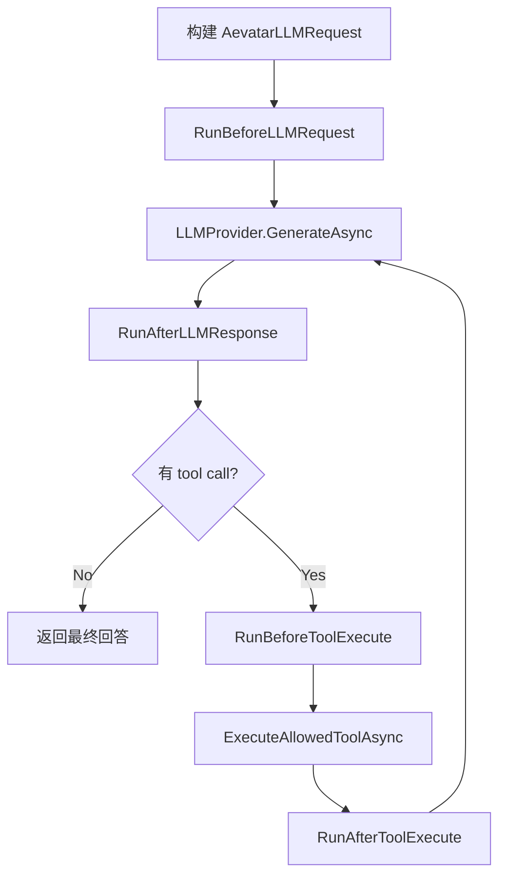

## AI Agent Hook Harness（agent-hooks-harness）讲解与使用指南

面向对象：团队同学（工程实现/扩展/排障）与老板（价值/风险/交付边界）。

### 30 秒讲给老板（结论先行）

- **这是什么**：给 `AIGAgentBase` 加了一层统一的“Hook/Harness 管线”，把上下文预算、工具输出治理、工具执行拦截、错误观测等横切能力从业务 Agent 中抽出来，做成可插拔的框架层能力。
- **解决什么问题**：长任务最常见的失败来自 **上下文爆炸**、**工具输出失控**、**跨团队策略不一致**。Harness 把这些“工程护栏”变成可配置、可观测、默认安全的统一机制。
- **为什么安全**：Hook **不能扩权**，只能收敛；并且在关键点做了“防御加固”（例如 hook 改完请求后，会再次执行 `AttachToolsToRequest` 重新应用工具可见性策略）。

### 现象层：我们在解决的真实痛点

- **上下文爆炸**：工具返回巨大文本/日志，下一轮 LLM 调用直接超窗或变慢。
- **治理散落**：每个业务 Agent/每个工具各写一套“截断/过滤/降级”，难维护、难审计。
- **稳定性不可控**：遇到 provider 差异、偶发错误时，缺少统一的 best-effort 兜底与可观测标注。

### 本质层：Hook Harness 是什么（已经实现的范围）

Hook Harness = **一个确定性、best-effort 的 Hook Pipeline** + **一组默认内置 hooks** + **可配置的禁用/预算** + **DI 注入扩展点**。

#### 已实现能力清单（MVP，已落地）

- **Hook 接口**：`IAevatarAgentHook`（阶段方法 + `Name`/`Priority`，默认空实现）
  - 文件：`src/Aevatar.Agents.AI.Core/Hooks/IAevatarAgentHook.cs`
- **Hook 上下文与安全策略快照**：`AevatarAgentHookContext` + `AevatarAgentHookPolicy`（只读）
  - 文件：`src/Aevatar.Agents.AI.Core/Hooks/AevatarAgentHookContext.cs`
- **Pipeline 执行器**：排序/禁用/best-effort/日志
  - 文件：`src/Aevatar.Agents.AI.Core/Hooks/AevatarAgentHookPipeline.cs`
  - 规则：
    - 排序：`Priority` 升序，其次 `Name`（不区分大小写）
    - 禁用：`AevatarAgentHookOptions.DisabledHooks`（不区分大小写）
    - 重名：**last wins**（后注册覆盖前注册，并记录 warning）
- **Options（预算/禁用）**：`AevatarAgentHookOptions`
  - 文件：`src/Aevatar.Agents.AI.Core/Hooks/AevatarAgentHookOptions.cs`
- **默认内置 hooks（默认启用）**
  - **ToolOutputTruncationHook**：工具输出截断（AfterToolExecute）
    - 文件：`src/Aevatar.Agents.AI.Core/Hooks/BuiltIn/ToolOutputTruncationHook.cs`
  - **ContextBudgetMonitorHook**：上下文预算告警（BeforeLLMRequest，warn-only）
    - 文件：`src/Aevatar.Agents.AI.Core/Hooks/BuiltIn/ContextBudgetMonitorHook.cs`
- **已接入 `AIGAgentBase` 的真实执行链路**
  - 文件：`src/Aevatar.Agents.AI.Core/AIGAgentBase.Hooks.cs`
  - 覆盖点：
    - LLM 调用：BeforeLLMRequest / AfterLLMResponse / OnError
    - Tool 执行：BeforeToolExecute / AfterToolExecute
    - Hook 可选“拒绝执行某个工具”（通过 `ctx.DenyTool(reason)`，纯收敛）
- **DI 注入（best-effort）**
  - `AIGAgentFactory` 创建 agent 时 **显式/类型安全** 注入：
    - `IOptions<AevatarAgentHookOptions>`（或直接注入 `AevatarAgentHookOptions`）
    - `IEnumerable<IAevatarAgentHook>`（从 DI 解析，未注册时为空集合）

#### 明确未实现（避免误解）

- **没有做自动 compaction/summary**：`ContextBudgetMonitorHook` 目前只告警与打标，不会自动修改消息。
- **没有做完整 retry/downgrade 策略集合**：只提供 `OnErrorAsync` 入口与 best-effort 日志，不包含复杂重试编排。
- **没有 UI/Dashboard**：这是框架层能力，不带可视化产品界面。

### 哲学层：为什么这样设计才对（框架层原则）

- **能消失的分支 > 能写对的分支**：把“每个业务 Agent 都要写一套治理逻辑”消掉，收敛到一条 pipeline。
- **默认安全（只能收敛）**：Hook 不能绕过 `AllowInternalTools/AllowDangerousTools`，并且在 hook 之后再次应用工具可见性策略，避免“旁路扩权”。
- **best-effort**：Hook 永远不应该把主链路拖死；失败记录日志但继续执行。
- **确定性**：同一配置在任何环境/运行时行为一致（排序稳定、禁用稳定）。

### 执行时序：它在运行时做了什么

（简化版）在一次 “LLM → tool loop → LLM …” 中，Hook Pipeline 的触发点如下：



### 怎么用（工程同学 5 分钟上手）

#### 0）默认就启用（你什么都不做也会生效）

`AIGAgentBase` 默认创建两种内置 hook（输出截断 + 预算告警）。这意味着：

- **默认会截断过长 tool 输出**（保护上下文）
- **默认会在接近阈值时打 warning log + metadata**（便于排障）

#### 1）配置预算 / 禁用某些 hooks（推荐：通过 `IOptions<T>`）

核心思路：宿主项目把 `AevatarAgentHookOptions` 绑定进 DI，框架会在创建 agent 时 best-effort 注入到 `AIGAgentBase.HookOptions`。

- **宿主注册（示例）**：

```csharp
// 宿主项目（例如 AppHost / Api）
services.Configure<Aevatar.Agents.AI.Core.Hooks.AevatarAgentHookOptions>(
    configuration.GetSection("Aevatar:AI:Hooks"));
```

- **配置文件（示例）**：

```json
{
  "Aevatar": {
    "AI": {
      "Hooks": {
        "DisabledHooks": ["ToolOutputTruncationHook"],
        "MaxToolOutputChars": 16000,
        "ContextMessageWarn": 64,
        "ContextCharsWarn": 200000
      }
    }
  }
}
```

说明：

- **DisabledHooks**：按 `hook.Name` 或类型名匹配（大小写不敏感）
- **MaxToolOutputChars**：tool 输出超过该长度会被截断（policy 快照会做合理 clamp）
- **ContextMessageWarn / ContextCharsWarn**：达到阈值会告警（仅信号，不改消息）

#### 2）添加自定义 hook（推荐：DI 注册 `IAevatarAgentHook`）

实现接口后注册到 DI 即可。接口默认方法都是 no-op，所以你只需要实现你关心的阶段。

```csharp
using Aevatar.Agents.AI.Core.Hooks;

public sealed class DenyCertainToolsHook : IAevatarAgentHook
{
    public int Priority => -100; // 越小越早执行

    public Task BeforeToolExecuteAsync(AevatarAgentHookContext ctx, CancellationToken ct)
    {
        // 例：纯收敛 —— 禁止执行某个工具
        if (string.Equals(ctx.ToolName, "publish_event", StringComparison.OrdinalIgnoreCase))
        {
            ctx.DenyTool("publish_event disabled by host policy");
        }

        return Task.CompletedTask;
    }
}

// 宿主注册
services.AddSingleton<IAevatarAgentHook, DenyCertainToolsHook>();
```

#### 3）在单元测试里验证 hook 行为（已经有现成用例）

直接参考测试即可把行为讲清楚（也方便给同学“看代码即懂”）：

- `test/Aevatar.Agents.AI.Core.Tests/Hooks/AevatarAgentHookPipelineTests.cs`
  - 排序：Priority + Name
  - 禁用：DisabledHooks（大小写不敏感）
  - best-effort：hook 抛异常不阻塞其他 hooks
- `test/Aevatar.Agents.AI.Core.Tests/Hooks/ToolOutputTruncationHookTests.cs`
- `test/Aevatar.Agents.AI.Core.Tests/Hooks/ContextBudgetMonitorHookTests.cs`

### 安全模型（老板/安全审阅最关心的点）

- **Hook 只能收敛**：安全策略通过 `AevatarAgentHookPolicy` 只读快照传给 hook，hook 无法“打开”危险权限。
- **Defense in depth（关键点）**：在 LLM 请求进入 provider 前，如果这次请求已经附带 `Functions`，会在 `BeforeLLMRequest` hooks 执行后再调用一次 `AttachToolsToRequest`，重新应用工具可见性策略，防止 hooks 旁路扩大工具集合。
  - 代码位置：`src/Aevatar.Agents.AI.Core/AIGAgentBase.Hooks.cs`
- **拒绝工具执行是显式的、可追踪的**：通过 `context.Metadata["deny_tool"]` 返回结构化失败结果，LLM 会看到明确拒绝原因。
 - **拒绝工具执行是显式的、可追踪的**：通过 `ctx.DenyTool(reason)` 返回结构化失败结果，LLM 会看到明确拒绝原因。

### 可观测性与排障

- **Pipeline 自带日志**
  - hook 失败：warning（包含 Hook 名、Stage、AgentId、RequestId）
  - hook 执行耗时：debug（ElapsedMs + RequestId）
- **ContextBudgetMonitorHook** 达阈值会写 warning log，并写入 metadata（`context_budget_*`）
- **ToolOutputTruncationHook** 截断时会写入 metadata（`tool_output_truncated` 等）

### 常见坑（提前踩掉）

- **把 secrets 放进 metadata/log**：`Metadata` 是调试标注，不是安全存储；只放小而无敏感的数据。
- **hook 里做重逻辑/大拷贝**：Pipeline 在主链路上，保持 O(1)~O(n hooks) 的轻量操作。
- **依赖执行顺序但不设 Priority**：跨团队 hook 叠加时，务必把关键策略 hook 的 `Priority` 固定下来。
- **把业务逻辑写进 hook**：hook 只做“横切治理”；业务规则仍应在 Agent 内部实现。

### 品味自检（这套实现的“好味道”与“坏味道”）

- **好味道**
  - best-effort + 确定性排序：框架层稳定、可预测。
  - 防御加固：hook 后重做工具策略应用，避免扩权旁路。
- **坏味道（可优化点）**
  - （已修复）“拒绝工具执行”已收敛为强类型 API：`ctx.DenyTool(reason)`，仍兼容旧的 metadata 写法。
  - （已修复）Hook 注入已改为 `AIGAgentFactory` 显式/类型安全注入，并在注入时使 hook pipeline 缓存失效，避免“注入不生效”。

### 后续改进建议（不影响当前交付）

- **强类型化的 deny 机制**：把 `deny_tool` 从 metadata 收敛为 `context.DenyTool(reason)` 之类的小 API。
- **更精确的预算模型**：从字符启发式升级到 token 估算（仍保持 bounded 计算）。
- **提供“降级策略 hook”样例**：例如 provider 协议差异修复、输出结构修复（仍遵循 best-effort）。

### 深入阅读（工程细节的权威来源）

- AI.Core 内部开发者指南：`src/Aevatar.Agents.AI.Core/docs/HOOKS_HARNESS.md`
- AI.Core 架构总览（含 Hooks/ 目录定位）：`src/Aevatar.Agents.AI.Core/docs/ARCHITECTURE.md`


