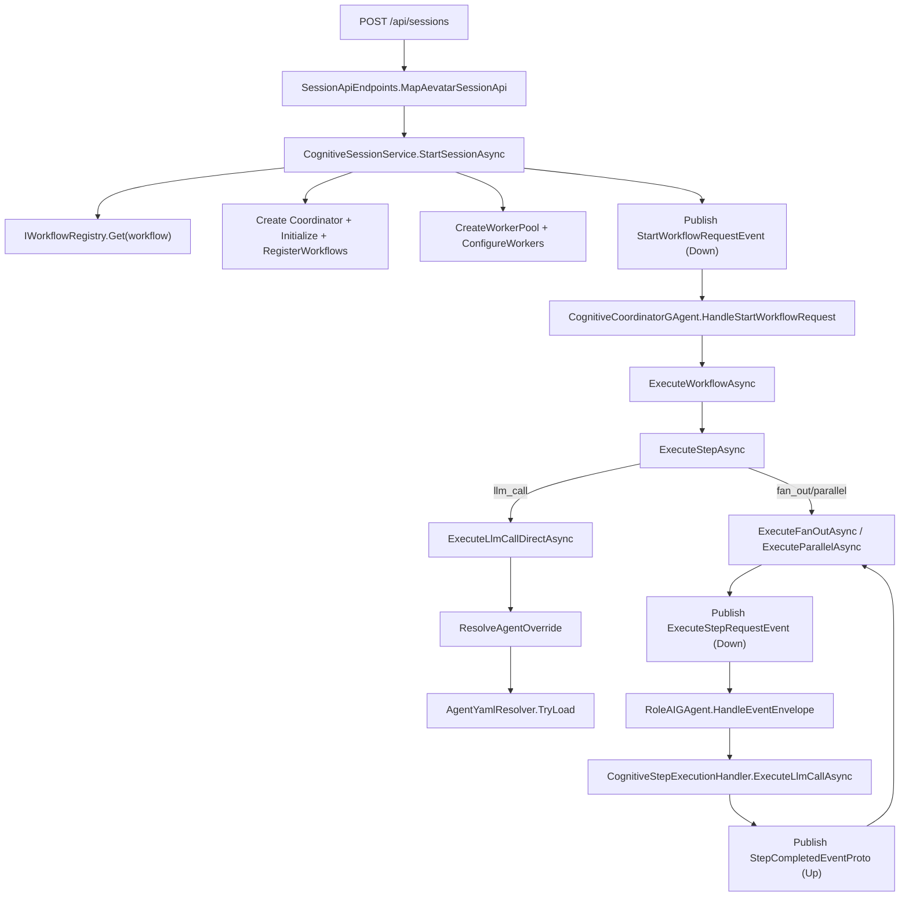

# Session → Workflow 最短路径（Cognitive + Sessions）

目标：梳理 `Aevatar.Agents.Sessions` 通过 Session 打开 Workflow YAML，
以及 `Aevatar.Agents.Cognitive` 执行 Workflow YAML，并在 `llm_call` 中按 `agent` 读取 Agent YAML 的最短代码路径。

---

## 0) 关键约束（Key constraints）

- **跨边界数据必须 Protobuf**：`StartSessionRequest` / `StartWorkflowRequestEvent` / `ExecuteStepRequestEvent` 都是 Protobuf。
- **Workflow YAML** 是运行时结构（`WorkflowDefinition`），不跨 Actor 边界。
- **Agent YAML** 仅用于 LLM 配置覆盖（system prompt / temperature / max_tokens）。

---

## 1) Workflow YAML 的加载路径（Registry）

最短路径（DI 启动时）：

1. `AddCognitiveAgents(...)` → `DependencyInjection/ServiceCollectionExtensions.cs`
2. `WorkflowParser.ParseDirectory(...)` 解析 `*.yaml` / `*.yml` → `WorkflowDefinition`
3. `InMemoryWorkflowRegistry.Register(...)` 保存到 `IWorkflowRegistry`

默认行为：

- 内置 `direct` workflow 会在 `LoadBuiltInWorkflows(...)` 中注册。
- **默认扫描目录是 `~/.aevatar/workflows`**（`ResolveDefaultWorkflowsDirectory`），
  repo 内置的 `src/Aevatar.Agents.Cognitive/workflows/` **不会自动加载**，
  需要显式设置 `options.WorkflowsDirectory` 或复制到 config 目录。

---

## 2) Session 打开 Workflow 的最短路径（API → Coordinator）

### 2.1 HTTP 入口

`POST /api/sessions` → `SessionApiEndpoints.MapAevatarSessionApi(...)`

### 2.2 Session Service

`CognitiveSessionService.StartSessionAsync(...)` 的核心步骤：

1. 从 `IWorkflowRegistry.Get(workflowName)` 取出 workflow
2. `CreateAndRegisterAsync<CognitiveCoordinatorGAgent>(...)` 创建 Coordinator
3. `coordinator.InitializeAsync(provider)` + `ConfigureSessionContext(...)`
4. `RegisterWorkflows(...)` 把 registry 中的 workflow 注册进 Coordinator 内部 registry
5. `CreateWorkerPoolAsync(...)` + `ConfigureWorkersAsync(...)`
6. 构建 `StartWorkflowRequestEvent` 并 `PublishEventAsync(..., EventDirection.Down)`

> Coordinator 内部自带 `InMemoryWorkflowRegistry`，所以需要 `RegisterWorkflows(...)` 手动注入。

---

## 3) Coordinator 执行 Workflow 的最短路径

入口事件：

`StartWorkflowRequestEvent` → `CognitiveCoordinatorGAgent.HandleStartWorkflowRequest(...)`

执行主链：

1. `HandleStartWorkflowRequest(...)`
2. `ExecuteWorkflowAsync(workflow)`
3. `ExecuteStepAsync(step)` 通过 `step.Type` 分发

常见分支：

- `llm_call` → `ExecuteLlmCallDirectAsync(...)`
- `fan_out` / `parallel` → `ExecuteFanOutAsync(...)` / `ExecuteParallelAsync(...)`
- `workflow_call` → `ExecuteWorkflowCallAsync(...)`（递归）

---

## 4) Agent YAML 的最短路径（agent → override）

触发条件：

Workflow 的 step 参数里包含 `agent: <role>`，且该 step 在 **Coordinator** 中执行。

最短路径：

1. `ExecuteLlmCallDirectAsync(...)`
2. `ResolveAgentOverride(step)`
3. `AgentYamlResolver.TryLoad(role, workingDirectory)`
4. 从以下路径读取 YAML：
   - `./aevatar/agents/{role}.yaml|yml`
   - `~/.aevatar/agents/{role}.yaml|yml`
5. 覆盖 `system_prompt` / `temperature` / `max_tokens`

注意：

- 通过 `ExecuteStepRequestEvent` 触发的 LLM 执行会读取 `agent/role` YAML 覆盖（system/temperature/max_tokens）。

---

## 5) 最短代码路径清单（File → Method）

### 5.1 Session → Workflow（直达）

1. `SessionApiEndpoints.cs` → `MapAevatarSessionApi` → `POST /api/sessions`
2. `CognitiveSessionService.cs` → `StartSessionAsync`
3. `CognitiveCoordinatorGAgent.Workflow.cs` → `HandleStartWorkflowRequest`
4. `Execution/WorkflowOrchestrator.cs` → `ExecuteAsync`
5. `CognitiveCoordinatorGAgent.cs` → `ExecuteStepAsync`
6. `Execution/CognitiveStepExecutor.cs` → `ExecuteAsync`
6. `CognitiveCoordinatorGAgent.Llm.cs` → `ExecuteLlmCallDirectAsync`
7. `CognitiveCoordinatorGAgent.Llm.cs` → `ResolveAgentOverride`
8. `Utilities/AgentYamlResolver.cs` → `TryLoad`

### 5.2 Session → Workflow（fan_out 并行）

1. `SessionApiEndpoints.cs` → `MapAevatarSessionApi` → `POST /api/sessions`
2. `CognitiveSessionService.cs` → `StartSessionAsync`
3. `CognitiveCoordinatorGAgent.Workflow.cs` → `HandleStartWorkflowRequest`
4. `CognitiveCoordinatorGAgent.cs` → `ExecuteStepAsync`
5. `CognitiveCoordinatorGAgent.Parallel.cs` → `ExecuteFanOutAsync`
6. `RoleAIGAgent` → `HandleEventEnvelope`（委托 `CognitiveStepExecutionHandler`）
7. `Execution/CognitiveStepExecutionHandler.cs` → `ExecuteLlmCallAsync`
8. `CognitiveCoordinatorGAgent.Parallel.cs` → `HandleStepCompletedEvent`

---

## 6) 最短路径图（Mermaid）

---

## 7) 连接是否打通（Checklist）

最短链路要满足：

1. **DI 注册**：`AddCognitiveAgents()` + `AddAevatarCognitiveSessions()`
2. **Workflow 已加载**：`IWorkflowRegistry.List()` 能看到目标 workflow
3. **Coordinator 注册 workflow**：`RegisterWorkflows(...)` 执行过
4. **Runtime 提供 `IGAgentActorManager`**
5. **Agent YAML 可选**：如需 `agent` override，确保 YAML 文件存在

